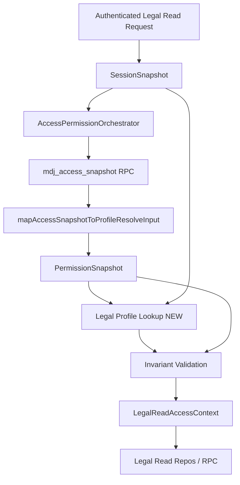

# LC-13B-0 — Identity Resolution Flow

**Ticket:** TICKET-V2-LEGAL-CENTER-LC-13B-0-IDENTITY-BRIDGE-DISCOVERY-AND-CONTRACT-001
**Status:** Discovery flow only — no runtime

---

## Canonical identity source (approved direction)

**Option D — Combinación controlada:**

```
auth.uid()
  + mdj_access_snapshot RPC (session-authenticated)
  + profile / legal identity lookup (future)
  + portal shell as UX hint only
```

Not approved alone: JWT custom claims · portal route · previewRole · client params.

---

## Resolution sequence (9 steps)

```
┌─────────────────────────────────────────────────────────────────┐
│ 1. Authenticated request enters legal read boundary             │
│    (ApiClient.rpc / future repository entry)                    │
└────────────────────────────┬────────────────────────────────────┘
                             ▼
┌─────────────────────────────────────────────────────────────────┐
│ 2. Read SessionSnapshot                                         │
│    - sessionId, portal (shell), user.userId, user.mdjbId        │
│    - FAIL: no session → identity_unavailable                    │
└────────────────────────────┬────────────────────────────────────┘
                             ▼
┌─────────────────────────────────────────────────────────────────┐
│ 3. Resolve PermissionSnapshot                                   │
│    - Prefer cached session permissions                          │
│    - Else: AccessPermissionOrchestrator → mdj_access_snapshot   │
│    - FAIL: RPC/parse → identity_unavailable                     │
└────────────────────────────┬────────────────────────────────────┘
                             ▼
┌─────────────────────────────────────────────────────────────────┐
│ 4. Map snapshot → ProfileResolveInput                           │
│    mapAccessSnapshotToProfileResolveInput()                     │
│    - staff_full + role → staff.owner | staff.manager            │
│    - staff_seller → staff.seller                              │
│    - artist tier → artist.*                                   │
│    - buyer → client.*                                         │
└────────────────────────────┬────────────────────────────────────┘
                             ▼
┌─────────────────────────────────────────────────────────────────┐
│ 5. Resolve documented role + profile kind                       │
│    resolveDocumentedRole() → PermissionSnapshot               │
│    - FAIL: guest / unknown → role_unresolved                    │
└────────────────────────────┬────────────────────────────────────┘
                             ▼
┌─────────────────────────────────────────────────────────────────┐
│ 6. Legal profile lookup (NEW — not implemented)                 │
│    auth.uid() + profile_kind → legalProfileId / recipient_id    │
│    - Artist: ART-* business ID                                │
│    - Client: CLI-* business ID                                │
│    - Staff: staff actor ID policy                               │
│    - FAIL: no row → profile_missing                           │
│    - FAIL: multiple → identity_ambiguous                      │
└────────────────────────────┬────────────────────────────────────┘
                             ▼
┌─────────────────────────────────────────────────────────────────┐
│ 7. Validate portal shell vs effective identity                  │
│    - session.portal vs profile.kind                             │
│    - Owner on artist shell: staff cross-read rules (PO)         │
│    - FAIL: incompatible → portal_mismatch                       │
└────────────────────────────┬────────────────────────────────────┘
                             ▼
┌─────────────────────────────────────────────────────────────────┐
│ 8. Build LegalReadAccessContext                                 │
│    - Map documented_role → short role                           │
│    - Set actorId, recipientScope                                │
│    - Validate invariants (contract doc)                         │
│    - FAIL: invariant break → contract_violation                 │
└────────────────────────────┬────────────────────────────────────┘
                             ▼
┌─────────────────────────────────────────────────────────────────┐
│ 9. Return context OR error                                      │
│    - Success → legal read repos / RPC caller                      │
│    - Deny → forbidden / not found per LC-13A policy             │
└─────────────────────────────────────────────────────────────────┘
```

---

## Portal: selected vs real vs effective

| Concept | Definition | Trusted? |
|---------|------------|----------|
| **Portal selected** | `session.portal` — shell user opened (staff/artist/client) | UX only |
| **Identity real** | `mdj_access_snapshot` profile_kind + role | **Yes** |
| **Capacity effective** | Intersection of real identity + portal + legal guards | **Yes** for authorization |

### Scenarios

| Scenario | Portal selected | Identity real | Effective capacity |
|----------|-----------------|---------------|-------------------|
| Owner opens staff portal | staff | staff_owner | Full staff legal read |
| Owner opens artist portal (lab) | artist | staff_owner | **PO decision:** deny cross-portal OR staff-only read without artist impersonation |
| Manager staff portal | staff | staff_manager | Ops read; no deleted submissions |
| Seller staff portal | staff | staff_seller | No fiscal |
| Artist artist portal | artist | artist_pro | Own-only |
| Client client portal | client | client_regular | Own-only; no W-9 |
| Seller opens client portal | client | staff_seller | **portal_mismatch** → forbidden |
| Artist opens client portal | client | artist_* | **portal_mismatch** → forbidden |

**LC-13B-0 recommendation:** Effective capacity = snapshot identity wins over portal shell. Portal mismatch → `portal_mismatch` unless explicit staff cross-read capability exists (future).

---

## Ownership resolution by entity

| Entity | Direct ownership | Derived | Invalid → |
|--------|------------------|---------|-----------|
| `LegalDocumentInstance` | `recipient_type` + `recipient_id` | — | not found (foreign) |
| `LegalW9Request` | `recipient_type` + `recipient_id` | from instance at create | not found |
| `LegalDocumentSubmission` | denorm `recipient_*` + parent EXISTS | instance join | deny if mismatch |
| `LegalAuditEvent` | `related_entity_ids[]` + `actor_id` | projection filter | hide row |

Bridge supplies `actorId`/`recipientScope` used by `matchesRecipientScope()` — not row params.

---

## Staff role lifecycle

| Question | Answer |
|----------|--------|
| Where does role live? | Postgres `dj_profiles.role` → `mdj_access_snapshot` → session `documentedRole` |
| How resolved? | RPC on session attach; `mapAccessSnapshotToProfileResolveInput()` |
| Sync | Re-fetch snapshot on login/refresh — **no client cache of role** |
| Role disappears mid-session | Next RPC/snapshot refresh → `role_unresolved`; deny new reads |
| Stale JWT | Irrelevant — V2 uses opaque bearer; snapshot is truth |
| URL previewRole | **Must not** override snapshot in production bridge |

---

## Artist / client profile

| Question | Answer |
|----------|--------|
| artist_profile_id source | **Missing:** need lookup `auth.uid()` → DJ profile → legal recipient `ART-*` |
| client_profile_id source | **Missing:** need lookup `auth.uid()` → `client_profiles` → `CLI-*` |
| Ownership validation | `actorId === row.recipient_id` for self-read |
| Multiple profiles | `identity_ambiguous` — require explicit profile selection (future UX) |
| No profile row | `profile_missing` — deny legal reads |

---

## Existing code touchpoints (implementation LC-13B — not now)

| Component | File | Role in flow |
|-----------|------|--------------|
| Session | `shared/session/runtime/session-service.ts` | Step 2 |
| Orchestrator | `shared/services/access-permissions/access-permission-orchestrator.ts` | Step 3 |
| Snapshot | `shared/services/access-snapshot/access-snapshot-service.ts` | Step 3–4 |
| Profile matrix | `shared/permissions/runtime/profile-matrix.ts` | Step 4–5 |
| Legal context | `shared/services/legal/persistence/legal-read-access-context.ts` | Step 8 output |
| Staff legal wire (today) | `staff/legal/staff-legal-provider-wire.ts` | **Replace** URL preview with bridge |

---

## Mermaid — target architecture


