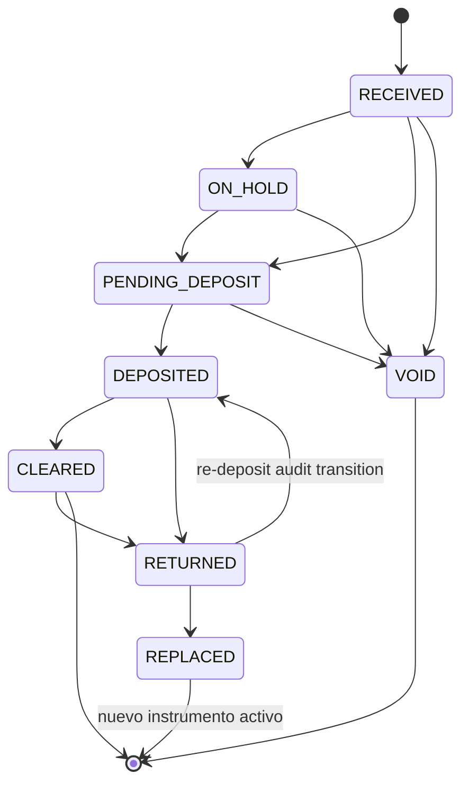
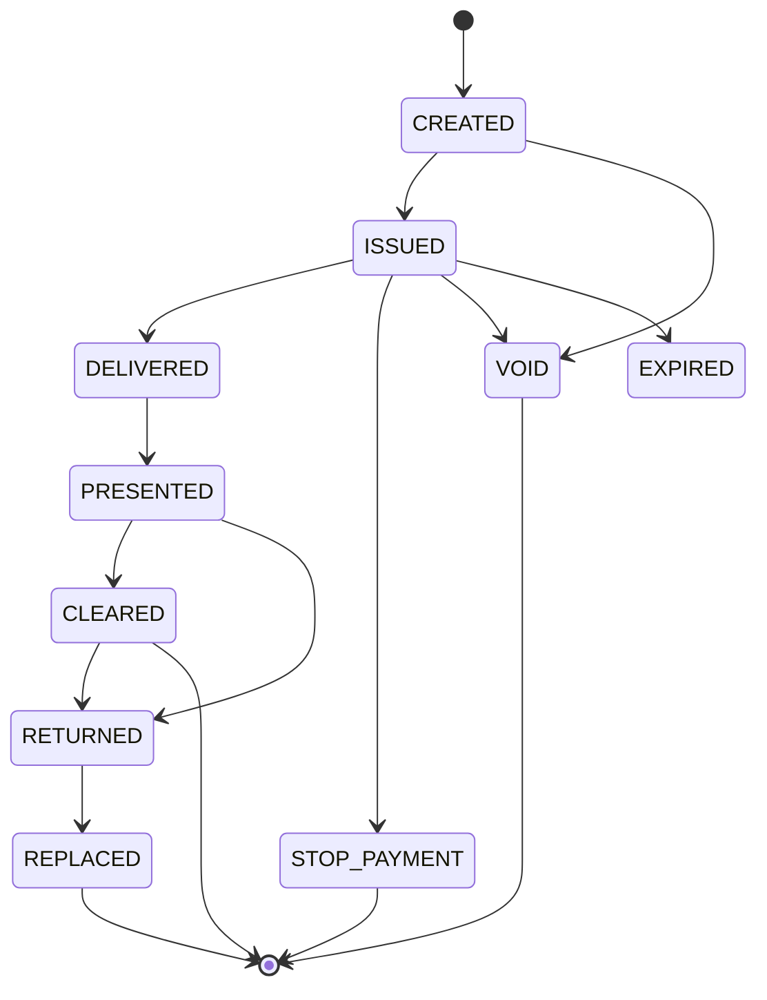
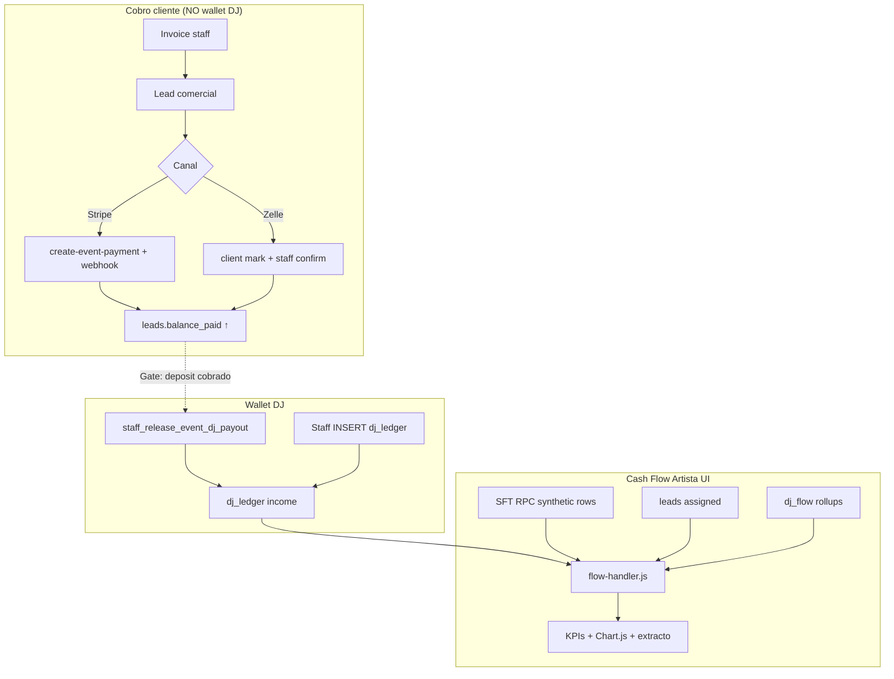

# TICKET-V2-ARTIST-CASH-FLOW-MANUAL-TRANSACTION-LEDGER-DISCOVERY-001

## Owner Financial Transaction Ledger — Discovery + Architecture

| Campo | Valor |
|-------|-------|
| Ticket | V2 Artist Cash Flow — Manual Transaction Ledger Discovery |
| Estado | **DISCOVERY ONLY** — revisión pre-commit arquitectónica (sin implementación) |
| Rama baseline | `plan/v2-phase-4-api-client` |
| HEAD baseline | `27b7cf0` — `docs(profile): add controlled reconciliation plan` |
| Fecha discovery | 2026-07-23 |
| Revisión documental | 2026-07-23 — C1–C6 + I1–I5 (auditoría pre-commit); addendum PO sistema financiero profesional + notificaciones artista |
| Alcance | Solo documentación — **cero cambios runtime / Supabase / commits** |
| Product Owner | Pendiente aprobación PO / segunda revisión |

---

## 0. Declaración operativa

Este ticket **no autoriza**:

- implementar UI, RPC, Edge Functions ni migraciones;
- modificar `flow-handler.js`, `production-module.js`, `stripe-webhook`, `staff_release_event_dj_payout`;
- alterar RLS, tablas existentes ni datos de producción;
- crear commits, push, PR, merge ni deploy.

**Estado esperado al cierre:** DISCOVERY COMPLETADO · IMPLEMENTACIÓN NO INICIADA · WORKING TREE SIN CAMBIOS DE RUNTIME · SIN COMMITS · ESPERAR APROBACIÓN PO.

---

## 1. Objetivo

Analizar la arquitectura actual de **Cash Flow Artista (V1)** y diseñar el concepto **Owner Financial Transaction Ledger (OFTL)** — un registro manual único del Owner que refleje operaciones contables reales del negocio con **doble impacto automático** (empresa + artista/staff) sin duplicar captura ni romper métricas existentes.

---

## 2. Contexto de producto (congelado PO — 2026-07-06)

Referencias obligatorias leídas:

| Documento | Rol |
|-----------|-----|
| `docs/architecture/CASH-FLOW-PRODUCT-DEFINITION-V1.md` | Cash Flow Artista **1D**; Cash Flow Empresa **P1 separado**; CFMovement **3B read-map primero**; **sin auto-release** payout |
| `docs/architecture/CFMOVEMENT-READ-MAP-SPEC-V1.md` | Contrato observador read-only; pipeline Invoice → Lead → Cobro → CFMovement → Payout |
| `docs/architecture/MASTER-WIRING-AUDIT-V1.md` | Hubs V1, brechas H1–H3, writers/readers |
| `docs/tickets/TICKET-004-financial-order-architecture.md` | North star 5 capas + `order_ledger` — **no implementado** |
| `docs/AGENT-MEMORY.md` | Baseline Cash Flow locked |

### Principio arquitectónico del ticket

```
Owner registra UNA operación
        ↓
Sistema materializa automáticamente:
  • Leg empresa (ingreso o gasto)
  • Leg artista/staff (ingreso o gasto) cuando aplique
        ↓
Ambos legs comparten transaction_group_id / idempotency_key
        ↓
Cash Flow Artista + Cash Flow Empresa + KPIs + historial + reportes
```

**Prohibido por producto:** segundo Cash Flow, doble captura manual, otro módulo financiero paralelo, romper wallet/KPIs actuales.

---

## 3. Fuera de alcance (este ticket)

- Schema SQL definitivo, migraciones, RLS productivas.
- UI Owner en admin-dashboard o V2 staff portal.
- Writers que modifiquen Invoice V1, webhook Stripe, release RPC congelados.
- CFMovement read-map implement (ticket V1 separado).
- Cash Flow Empresa UI P1 (ticket separado).
- Auto-release cobro → `dj_ledger`.
- Reconciliación de perfiles / identidad (tickets V1 paralelos).

---

## 4. Baseline Git

### 4.1 Baseline de esta revisión (2026-07-23)

| Check | Resultado |
|-------|-----------|
| Rama | `plan/v2-phase-4-api-client` ✓ |
| HEAD | `27b7cf08f9528cba6eb098f731be5eb0c3bf4bfe` (`27b7cf0`) ✓ |
| Working tree inicial | **Únicamente** discovery untracked: `docs/V2/TICKETS/TICKET-V2-ARTIST-CASH-FLOW-MANUAL-TRANSACTION-LEDGER-DISCOVERY-001.md` |

### 4.2 Nota histórica de trazabilidad

La **primera versión** de este discovery se redactó con HEAD `8903b75` (`docs: record end-of-day status for 2026-07-23`), **antes** del cierre documental del ticket `TICKET-V1-PROFILE-RECONCILIATION-PLAN-001` (commit `27b7cf0`). El análisis V1 del §5 no depende de ese delta de HEAD.

---

## 5A. Fundamentos arquitectónicos — revisión pre-commit

Las subsecciones **5A.1–5A.11** y **§5B** resuelven ambigüedades identificadas en la auditoría técnica pre-commit y el addendum PO (sistema financiero profesional + notificaciones). Son **documentación de diseño**; no implican tablas, RPC ni código existente.

### 5A.1 Financial Authority Matrix (C1)

**OFTL no es Single Source of Truth global** del sistema financiero MDJB mientras coexistan fuentes legítimas V1 ( `leads`, webhooks, release RPC) y legacy no convergidas. OFTL es **autoridad canónica solo del subdominio** «operación manual Owner registrada en OFTL» y sus proyecciones derivadas.

#### Tipos de registro (clasificación transversal)

| Tipo | Definición |
|------|------------|
| **Canonical Record** | Hecho económico autorizado; una sola fila fuente por hecho |
| **Derived Projection** | Vista/materialización derivada; **no** es hecho económico nuevo |
| **Legacy Authority** | Fuente V1 vigente hasta migración PO explícita |
| **External Financial Source** | Stripe, banco, procesador — evidencia externa |
| **Audit Event** | Trazabilidad append-only; no sustituye canonical |

#### Matriz por dominio

| # | Dominio | V1 actual (autoridad) | V2 propuesta | Writer autorizado V1/V2 | Readers principales | Canónico / proyección | Fase cambio autoridad | Coexistencia temporal |
|---|---------|----------------------|--------------|-------------------------|---------------------|----------------------|----------------------|------------------------|
| 1 | **Cobro del cliente** | `leads.balance_paid` + `payment_status` | Igual hasta migración PO | Stripe webhook, Zelle RPC (`staff_confirm_event_zelle_deposit`) | Portal cliente, producción, admin, CFMovement read-map | **Legacy Canonical** | Fase 6+ (writers CFMovement aditivos) | OFTL **referencia** lead; no reemplaza webhook |
| 2 | **Estado financiero lead/booking** | `leads` (total, deposit, status, invoice link) | Igual + optional link OFTL | Event Builder, producción, portal | Staff, artista (subset), CFMovement | **Legacy Canonical** | Fase 8 TICKET-004 | OFTL enriquece metadata |
| 3 | **Obligación de pagar al artista** | `leads.dj_agreed_payout_usd` (+ pending implícito) | **`FinancialObligation`** (§5A.4) | Staff producción (acuerdo); futuro OFTL obligation | Owner, manager, artista (own payout) | Canonical → obligation entity fase 1 contracts | Fase 1 contracts | Lead field legacy hasta sync |
| 4 | **Pago ejecutado al artista** | `staff_release_event_dj_payout` **o** staff INSERT legacy | **`OwnerFinancialTransaction`** (escenarios §5A.3) **o** release RPC booking | Ver Writer Matrix §5A.3 | Owner, artista wallet | **Canonical** (uno por hecho) | Fase 4 bridge | Release RPC congelado coexiste |
| 5 | **Wallet / Cash Flow visible artista** | `dj_ledger` (+ SFT merge UI) | **`dj_ledger`** (proyección) | Release RPC, OFTL bridge, legacy INSERT (deprecar) | `flow-handler.js`, rollups | **Derived Projection** visible | Sin cambio fase 1 | KPIs leen ledger, no OFTL directo |
| 6 | **Operación manual Owner** | No existe (gap) | **`OwnerFinancialTransaction`** | OFTL service (Owner/Manager capabilities) | Owner, manager, audit | **Canonical** (subdominio OFTL) | Fase 3 schema + 5 UI | No absorbe cobros Stripe auto |
| 7 | **Instrumento bancario (cheque, etc.)** | No existe | **`CheckInstrument`** + `BankSettlement` (modelos conceptuales) | OFTL check workflows (futuro) | Owner, manager | **Canonical** instrumento; settlement separado | Fase 2 check SM | Cheque ≠ transaction lifecycle |
| 8 | **Auditoría financiera** | Fragmentada (webhook log, metadata) | **`CFMovement`** + `OwnerFinanceAuditTrail` | Projectors read-only / append audit | Owner, manager | **Audit Event / projection** | Fase 6 CFMovement implement | CFMovement **no** writer duplicado de cobro |
| 9 | **Proyección Cash Flow Empresa** | Admin ad hoc sobre `leads` | Agregación **company legs** + read-map | N/A (read) | Owner, manager | **Derived Projection** | Fase 7 Empresa UI P1 | Merge leads + OFTL legs |

#### Reglas explícitas PO

1. **`leads.balance_paid`** permanece autoridad del cobro cliente hasta ticket de migración aprobado.
2. **`dj_ledger`** permanece proyección visible del wallet artista en fase compatibilidad.
3. **OFTL** es autoridad de operaciones manuales Owner **creadas en OFTL**, no de todos los cobros existentes.
4. **CFMovement** es audit/projection según contrato **3B** — observador primero; writers aditivos solo con ticket PO.
5. Proyecciones derivadas (`dj_ledger`, rollups, CFMovement, company metrics) **no** son hechos económicos nuevos.

### 5A.2 Máquinas de estado separadas (C2 + I1)

**Prohibido** usar un único campo `status` para ciclo de transacción **y** ciclo de cheque.

#### A. `TransactionLifecycleStatus` (entidad `OwnerFinancialTransaction`)

Estados **seleccionados** tras validación (redundantes eliminados):

| Estado | Significado | Entrada típica | Salidas | Terminal | Efecto financiero | Proyecciones | Reversible |
|--------|-------------|----------------|---------|----------|-------------------|--------------|------------|
| **DRAFT** | Captura iniciada, no confirmada | Owner save draft | PENDING, VOIDED | No | Ninguno | No | N/A |
| **PENDING** | Confirmada operativamente; settlement incompleto | Submit; cheque RECEIVED | POSTED, PARTIALLY_SETTLED, VOIDED, FAILED | No | Obligación/allocation registrada; cash no final | Legs pending opcionales | VOID |
| **POSTED** | Hecho económico reconocido | Cash paid; check CLEARED | PARTIALLY_SETTLED, SETTLED, REVERSED | No | Legs company/artist posted | dj_ledger, CFMovement | REVERSED |
| **PARTIALLY_SETTLED** | Pago parcial vs obligación | Partial allocation | SETTLED, POSTED (+ más pagos) | No | Allocation open balance | Ledger parcial | REVERSED parcial |
| **SETTLED** | Obligación cubierta totalmente | Full allocation | REVERSED | Sí* | Cierre obligación | Completo | REVERSED |
| **REVERSED** | Contra-asiento append-only | Reversal workflow | — | Sí | Compensating entries | Reversal projections | No |
| **VOIDED** | Anulada antes de POSTED | Owner void draft/pending | — | Sí | Sin efecto posted | Ninguna | No |
| **FAILED** | Error irrecuperable registrado | Projection failure terminal | — | Sí | Audit only | Retry manual | No |

*SETTLED es terminal operativo para la **transacción**; REVERSED puede aplicarse después vía hecho compensatorio. **SETTLED ≠ CLEARED:** un pago cash puede estar SETTLED el mismo día; un cheque puede estar POSTED/SETTLED en obligación mientras el instrumento aún está DEPOSITED (bank pending).*

#### Ownership de estados (sin reutilizar enums entre entidades)

| Entidad | Campo de estado | Enum propio | Notas |
|---------|-----------------|-------------|-------|
| **`OwnerFinancialTransaction`** | `lifecycle_status` | **`TransactionLifecycleStatus`** | § tabla arriba |
| **`FinancialObligation`** | `obligation_status` | **`ObligationLifecycleStatus`**: `OPEN`, `PARTIALLY_PAID`, `PAID`, `CANCELLED`, `REVERSED` | Parcial = suma allocations < monto obligación |
| **`CheckInstrument`** | `lifecycle_status` | **`CheckInstrumentStatus`** | §5A.2 B; incluye `check_direction` |
| **`BankSettlement`** | `settlement_status` | **`BankSettlementStatus`**: `PENDING`, `DEPOSITED`, `CLEARED`, `RETURNED`, `FAILED` | Hecho bancario; no sustituye transaction lifecycle |
| **`PaymentAllocation`** | — | Sin lifecycle propio | Filas append-only; vigencia vía payment + obligation status |

**Reglas de revisión (TransactionLifecycleStatus):**

1. **DRAFT** — sin efecto financiero; sin proyecciones.
2. **PENDING** — confirmada operativamente; **no** proyectar como dinero liquidado en wallet/KPIs.
3. **POSTED** — hecho financiero reconocido; **no implica** compensación bancaria (cheque puede estar DEPOSITED).
4. **PARTIALLY_SETTLED** — aplica a **transacción** cuya `PaymentAllocation` no agota el pago o no cierra todas las obligaciones vinculadas; **no** es estado de cheque.
5. **SETTLED** — transacción con allocations completas según reglas de negocio; **no** equivale a CLEARED para todos los métodos.
6. **REVERSED** — requiere **`appendReversal`** vinculado (`reversal_of_id`); compensating entry obligatoria.
7. **VOIDED** — solo **antes** de POSTED (desde DRAFT/PENDING); sin efecto posted irreversible.
8. **FAILED** — registro de intento/proyección fallida; **audit event** separado; no borra canonical; reintento idempotente permitido.

#### B. `CheckInstrumentStatus` + `check_direction`

Campo **`check_direction`:** `INCOMING` | `OUTGOING`.

Relación cheque ↔ transacción:

- `CheckInstrument.lifecycle_status` gobierna el instrumento.
- `OwnerFinancialTransaction.lifecycle_status` refleja reconocimiento contable (POSTED cuando instrumento CLEARED incoming; OUTGOING según reglas §5A.2 B).

**Incoming check** (producto mínimo):



| Estado incoming | Uso |
|-----------------|-----|
| RECEIVED | En mano |
| ON_HOLD | Disputa / verificación |
| PENDING_DEPOSIT | Listo para depósito |
| DEPOSITED | Entregado al banco |
| CLEARED | Compensado |
| RETURNED | NSF / devuelto |
| VOID | Anulado pre-depósito |
| REPLACED | Sustituido — enlace `replaces_check_id` / `replaced_by_check_id` |
| EXPIRED | Cheque vencido sin cobro |

**Decisión REDEPOSITED — Opción A (transición auditada, no estado persistente):**

`REDEPOSITED` **no** es un valor de `CheckInstrumentStatus`. Tras **RETURNED**, la acción **re-deposit** se registra como:

1. `recordStatusTransition`: RETURNED → DEPOSITED (mismo instrumento, **nueva** fecha de depósito).
2. Nuevo **`BankSettlement`** (append) para el segundo intento.
3. Audit trail (`OwnerFinanceAuditTrail`) con motivo `re_deposit`.

El instrumento vuelve a **DEPOSITED** con historial de transiciones; no se crea estado intermedio persistente. Métricas «pending checks» siguen leyendo DEPOSITED/CLEARED actuales.

**Outgoing check** (producto mínimo):



| Estado outgoing | Uso |
|-----------------|-----|
| CREATED | Registrado, no emitido |
| ISSUED | Emitido a beneficiario |
| DELIVERED | Entregado (opcional si se conoce) |
| PRESENTED | Presentado al banco por beneficiario |
| CLEARED | Pagado por banco |
| STOP_PAYMENT | Orden de no pago |
| VOID | Anulado |
| RETURNED | Devuelto / rechazado |
| REPLACED | Sustituido por nuevo cheque |
| EXPIRED | No cobrado a tiempo |

**Enlace REPLACED (incoming y outgoing):**

- El cheque **anterior permanece inmutable** (historial append-only).
- `replaces_check_id` (anterior) + `replaced_by_check_id` (nuevo) en **`CheckInstrument`**.
- El **nuevo** cheque tiene **identidad independiente** (nuevo UUID); **no** se reutiliza check number del anterior.
- **No** UPDATE destructivo del instrumento previo; transacción nueva opcional si cambia monto/método.
- Audit trail obligatorio en `recordStatusTransition` + `OwnerFinanceAuditTrail`.

### 5A.3 Financial Writer Exclusivity Matrix (C3)

**Regla:** un mismo **hecho económico** → **un solo writer canónico**. Proyecciones derivadas no cuentan como hechos nuevos.

| # | Escenario | Writer canónico | Proyecciones permitidas | Writers prohibidos simultáneos |
|---|-----------|-----------------|-------------------------|--------------------------------|
| 1 | Release payout booking | `staff_release_event_dj_payout` | CFMovement read-map; company leg (futuro) | OFTL artist payment mismo `lead_id`; legacy INSERT mismo event |
| 2 | Pago manual sin booking | **OFTL** `OwnerFinancialTransaction` | `dj_ledger` bridge; company leg; audit | Release RPC; legacy INSERT |
| 3 | Corrección contable | **OFTL** `accounting_correction` (append) | Reversal legs; audit | UPDATE destructivo ledger |
| 4 | Reversión general | **OFTL** reversal transaction | Compensating legs; CFMovement reversed | DELETE |
| 5 | Cheque devuelto | **OFTL** reversal + `CheckInstrument` RETURNED | Company reversal; optional lead flag | DELETE cheque row |
| 6 | Pago parcial | **OFTL** Payment + Allocation | Partial ledger; obligation balance | Segundo writer mismo installment |
| 7 | Cobro Stripe | **stripe-webhook** → `leads` | CFMovement projection; read-map | OFTL duplicate cobro mismo PI |
| 8 | Cobro Zelle | **staff_confirm_event_zelle_deposit** | CFMovement; read-map | OFTL duplicate mismo confirm |
| 9 | Import bancaria futura | **OFTL** `source_system=import` | ReconciliationRecord | Manual duplicate |
| 10 | Reproceso idempotente | Mismo writer | Skip insert si key exists | Segunda fila canonical |

#### Idempotencia conceptual (Data Contracts / schema futuro)

| Clave | Uso |
|-------|-----|
| `source_system` + `source_record_id` | Writer externo (webhook, release RPC, OFTL) |
| `idempotency_key` | Global OFTL |
| `transaction_group_id` | Legs + proyecciones del mismo hecho |
| `lead_id` + `movement_kind` | Evitar doble payout/release |
| `external_reference` | Stripe PI, Zelle confirm, check number + bank |

**Unicidad a resolver en contracts/schema (documentado, no SQL aquí):**

- `UNIQUE(source_system, source_record_id)` en canonical transactions.
- `UNIQUE(idempotency_key)` en OFTL.
- `UNIQUE(dj_ledger projection)` por `(source_system, owner_transaction_id)` o `(lead_id, source=event_sale_release)`.

Legacy **staff INSERT `dj_ledger`:** clasificado **Legacy Authority** — deprecación UI fase 5; no writer canónico para hechos nuevos post-OFTL.

### 5A.4 Capa Obligation / Payment / Allocation / Settlement / Reconciliation (C4)

**Principio PO (addendum):** no usar un único registro para representar simultáneamente obligación, pago, asignación, instrumento bancario, liquidación, conciliación, auditoría ni notificación. Cada concepto tiene responsabilidad operativa propia.

Flujo documentado (responsabilidades separadas):

```
FinancialObligation
        ↓
Payment (OwnerFinancialTransaction)
        ↓
PaymentAllocation
        ↓
BankSettlement
        ↓
ReconciliationRecord
        ↓
Derived Projections (Cash Flow Artista/Empresa, KPIs, rollups, reportes)
        ↓
Reporting and Notifications (avisos derivados — §5B; no hechos económicos)
```

| Etapa | Qué representa | Qué NO representa |
|-------|----------------|-------------------|
| **FinancialObligation** | Dinero debido (cobrar o pagar) | Pago ejecutado, settlement bancario, aviso al artista |
| **Payment** | Dinero entregado o recibido por un método determinado | Obligación original, conciliación externa, email/SMS |
| **PaymentAllocation** | Cómo un pago se aplica a una o varias obligaciones | Movimiento bancario, ledger contable completo |
| **BankSettlement** | Comportamiento banco/procesador (depósito, clearing, devolución, fallo) | Obligación comercial, notificación |
| **ReconciliationRecord** | Correspondencia interno ↔ procesador ↔ banco ↔ obligación ↔ pago | Proyección UI, mensaje transaccional |
| **Derived Projection** | Vista derivada (no nuevo hecho económico) | Fuente de verdad canónica |
| **Reporting / Notification** | Informe o aviso al artista/Owner | Transacción financiera, allocation, balance |

**`OwnerFinancialTransaction` representa el pago/cobro ejecutado — no la obligación original, ni la entrega de email/SMS.**

#### Entidades conceptuales

| Entidad | Responsabilidad |
|---------|-----------------|
| **`FinancialObligation`** | Monto debido: artista, staff, vendor, cliente (por cobrar), comisión, reembolso |
| **`Payment`** | Sinónimo operativo de `OwnerFinancialTransaction` cuando liquida obligación(es) |
| **`PaymentAllocation`** | Vincula payment ↔ obligation(es); soporta parcial, multi-target |
| **`BankSettlement`** | Hecho bancario (modelo conceptual; **pendiente implementación**) |
| **`ReconciliationRecord`** | Match externo (modelo conceptual; **pendiente implementación**) |

#### `FinancialObligation` — capacidades

- Artista por pagar · staff por pagar · vendor · cliente por cobrar · comisión · reembolso.
- **N pagos → 1 obligación** · **1 pago → N obligaciones** · parcial · saldo pendiente · sobrepago · reversión · cancelación.
- Con o sin booking; link opcional `lead_id`, `staff_invoice_id`, `event_ref`.
- **`PaymentAllocation`:** suma de `allocated_minor_units` por payment **≤** `amount_minor_units` del payment (sobrepago prohibido salvo línea **`UnappliedCashBalance`** explícita — ver UC-12).
- Pago no asignado → **`UnappliedCashBalance`** (concepto suspense; **no** inventar obligación falsa).

Origen V1 legacy: `dj_agreed_payout_usd` / `total_amount` / invoice → obligation **derivada** en fase contracts (no ALTER leads en discovery).

### 5A.5 Repositorio append-only — semántica (C5)

**Corregido:** el repositorio expone operaciones **append-only** + lectura (no operaciones genéricas de update/delete sobre hechos monetarios).

Operaciones conceptuales (no interfaces TS finales):

| Operación | Propósito |
|-----------|-----------|
| `appendTransaction` | Nuevo hecho canonical |
| `appendLeg` | Leg derivado |
| `appendAllocation` | Allocation |
| `recordStatusTransition` | Transición auditada lifecycle / check |
| `appendReversal` | Compensating entry |
| `readById` / `listByArtist` / `listByCompany` / `listBySource` / `listByDateRange` | Consultas |

**Reglas:**

- No DELETE financiero ordinario.
- No UPDATE destructivo del hecho monetario.
- Corrección = compensating entry, reversal o transición auditada.
- Metadata administrativa no monetaria: reglas separadas; nunca sobrescribir monto/historial sin audit trail.

### 5A.6 Canonical money representation (C6)

**Representación canónica de persistencia:** `amount_minor_units` (entero) + `currency_code` (text).

Ejemplo USD: **$350.25 → `35025`** minor units.

| Regla | Detalle |
|-------|---------|
| Tipo | Entero; **sin floating point** en persistencia |
| Moneda inicial | `USD` (`currency_code`) |
| Multi-moneda futura | `currency_code` extensible; conversión fuera de scope |
| Display | View derivada (`amount_display_usd` o formateo UI) — **no** canonical |
| Legacy `amount_usd` | Solo display/interop temporal en docs V1 |
| **`dj_ledger`** | Ya usa `amount_cents` — alinear bridge 1:1 minor units |
| Fees / tips / tax / discount | Líneas separadas o metadata; cada línea con own minor units |
| Comisiones SFT | Bruto/neto/fee como líneas distinct (patrón V1 10%) |
| Reversals | Monto compensatorio en **nueva** fila; `reversal_of_id`; **no** editar `amount_minor_units` original |
| Allocations | Σ `allocated_minor_units` ≤ payment `amount_minor_units`; excedente → `UnappliedCashBalance` |

### 5A.7 Financial taxonomy — responsabilidades únicas

| Campo | Responsabilidad única |
|-------|----------------------|
| **`direction`** | Sentido empresa: `INFLOW` \| `OUTFLOW` \| `INTERNAL_TRANSFER` \| `ADJUSTMENT` |
| **`operation_type`** | Tipo de hecho de negocio (artist payment, client receipt, correction…) |
| **`company_category`** | Clasificación P&L empresa (Artist Compensation, Refund…) — **no** canal de pago |
| **`payment_method`** | Medio/instrumento de pago — §5A.8 |
| **`payment_provider`** | Procesador o rail — §5A.8 |
| **`external_reference`** | ID externo (pi_xxx, zelle_confirm_id, wire_ref) |
| **`counterparty_type`** | Rol contraparte: ARTIST, STAFF, CLIENT, VENDOR, COMPANY, NONE |

**No mezclar:** Stripe/Zelle como `company_category` — solo `payment_method` / `payment_provider`.

#### Matriz de ejemplos válidos (conceptual)

| Escenario | direction | operation_type | company_category | payment_method | payment_provider | counterparty_type |
|-----------|-----------|----------------|------------------|----------------|------------------|-------------------|
| Pago artista cheque | OUTFLOW | ARTIST_COMPENSATION_PAYMENT | ARTIST_COMPENSATION | CHECK | — | ARTIST |
| Cobro cliente Stripe | INFLOW | CLIENT_PAYMENT_RECEIVED | CLIENT_PAYMENT | CARD | STRIPE | CLIENT |
| Transferencia Zelle | INFLOW | CLIENT_PAYMENT_RECEIVED | CLIENT_PAYMENT | DIGITAL_WALLET | ZELLE | CLIENT |
| ACH bancario | INFLOW | CLIENT_PAYMENT_RECEIVED | CLIENT_PAYMENT | ACH | BANK | CLIENT |
| Cheque incoming | INFLOW | CLIENT_CHECK_RECEIVED | CLIENT_PAYMENT | CHECK | NONE | CLIENT |
| Efectivo | OUTFLOW | ARTIST_COMPENSATION_PAYMENT | ARTIST_COMPENSATION | CASH | NONE | ARTIST |

### 5A.8 Payment method y payment provider (I3)

**Separación obligatoria:** `payment_method` = cómo se pagó; `payment_provider` = quién procesó (si aplica). **Stripe y Zelle nunca son `company_category`.**

#### `payment_method` (registry inicial — extensible vía catálogo PO)

| Code | Uso |
|------|-----|
| CASH | Efectivo |
| CHECK | Requiere `CheckInstrument` |
| CARD | Tarjeta crédito/débito vía procesador |
| ACH | ACH / débito bancario directo |
| WIRE | Wire transfer |
| BANK_TRANSFER | Transferencia bancaria genérica (no ACH) |
| DIGITAL_WALLET | P2P wallets (Zelle, Venmo, PayPal cuando el rail es wallet) |
| OTHER | Puente temporal hasta catálogo PO |

#### `payment_provider` (registry inicial)

| Code | Uso |
|------|-----|
| STRIPE | Stripe Checkout / PI |
| ZELLE | Zelle confirm |
| VENMO | Venmo |
| PAYPAL | PayPal |
| BANK | Banco / ACH directo sin procesador marca |
| NONE | Sin procesador (cash, cheque físico, wire directo) |
| OTHER | Procesador futuro |

**`external_reference`:** ID del procesador (`pi_xxx`, confirm id Zelle, wire ref).

**Ejemplos canónicos (5 obligatorios):**

| # | Caso | payment_method | payment_provider | external_reference |
|---|------|----------------|------------------|-------------------|
| 1 | Tarjeta vía Stripe | CARD | STRIPE | `pi_xxx` |
| 2 | Zelle | DIGITAL_WALLET | ZELLE | confirm / memo id |
| 3 | ACH bancario | ACH | BANK | trace number |
| 4 | Cheque | CHECK | NONE | check number + bank |
| 5 | Efectivo | CASH | NONE | — |

Nuevos métodos/proveedores → ampliar registry; **no** usar `OTHER` como destino permanente de métodos conocidos.

### 5A.9 Atomicidad y proyecciones (I4)

| Clase | Qué incluye | Consistencia |
|-------|-------------|--------------|
| **Atomic Canonical Write** | OFTL transaction + legs + allocations + audit event | Debe ser **una unidad lógica** (futuro: transacción DB) |
| **Eventually Consistent Projection** | `dj_ledger` bridge, `dj_flow_*` refresh, CFMovement materialize | Puede reintentar |

#### Fallos documentados

| Fallo | Comportamiento arquitectónico |
|-------|------------------------------|
| OFTL guardado; falla `dj_ledger` | Canonical POSTED o PENDING según reglas; projection `FAILED` + retry idempotente |
| `dj_ledger` OK; falla rollup | Wallet visible; rollup refresh reintentable (`refresh_dj_flow_rollups_for_user`) |
| Reintento misma `idempotency_key` | No second canonical; return existing |
| Doble click Owner | Idempotency key dedupe |

Responsabilidad: **OFTL service** orquesta orden; schema ticket define transacción; rollups **no** bloquean canonical write.

### 5A.10 Autorización capability-based (permisos)

No basar escritura financiera sensible solo en `is_staff`. **Seller** no hereda capacidades financieras por portal Staff.

Capacidades conceptuales (asignación final = ticket posterior + PO):

| Capability | Acción |
|------------|--------|
| `finance.transaction.create` | Registrar pago/cobro manual |
| `finance.transaction.reverse` | Reversal / corrección compensatoria |
| `finance.check.record` | Crear instrumento cheque |
| `finance.check.update_status` | Transiciones check SM |
| `finance.expense.approve` | Aprobar gasto (futuro) |
| `finance.reconciliation.manage` | ReconciliationRecord |
| `finance.audit.read` | Audit trail / CFMovement export |

Gate mínimo documentado: **`is_staff_management(auth.uid())`** para create/reverse hasta RBAC V2 completo.

### 5A.11 OFTL como ledger operacional — no contabilidad general (addendum PO)

OFTL es el **ledger operacional financiero** de Miami DJ Beat V2: registra hechos de negocio verificables (obligaciones, pagos, allocations, settlement, reconciliation) con historial append-only e idempotencia. **No** debe presentarse ni diseñarse como sustituto de:

| Capacidad | Estado en este discovery |
|-----------|--------------------------|
| General Ledger contable completo | **No cubierto** — integración futura posible |
| Contabilidad de doble partida certificada | **No afirmado** |
| QuickBooks / ERP contable | **No cubierto** |
| Sistema fiscal / payroll tributario | **No cubierto** |
| Motor 1099 / W-2 | **No cubierto** |
| Conciliación bancaria automática end-to-end | **No cubierto** (ReconciliationRecord es concepto; automatización posterior) |

**Reglas de diseño:**

- Usar terminología financiera convencional; **no** inventar conceptos artificiales solo para acomodar la UI V1.
- El diseño **no bloquea** integraciones posteriores (GL, tax, bank feed).
- El diseño **no afirma** que esas capacidades ya existen.
- Separación obligatoria mantenida: obligación ≠ pago ≠ allocation ≠ settlement ≠ reconciliation ≠ proyección ≠ notificación.

---

## 5B. Notificaciones de actividad financiera del artista (addendum PO — conceptual)

**Alcance:** documentación únicamente. **No** implementar servicios, email, SMS, templates, workers, colas, Edge Functions, tablas, migraciones, proveedores ni UI en este ticket. **No** iniciar Data Contracts de notificaciones aquí.

### 5B.1 Desacoplamiento obligatorio

Una notificación **no** es parte del hecho financiero canónico.

```
Canonical Financial Write (OFTL POSTED / allocation confirmada)
        ↓
Committed Domain Event o Transactional Outbox Record (misma unidad transaccional lógica)
        ↓
Notification Processing (async, retry-safe)
        ↓
Email / SMS / In-App Delivery
```

**Fallo de email, SMS o proveedor externo:**

- **No** revierte el pago ni altera allocations.
- **No** duplica el pago ni crea otra transacción financiera.
- **No** impide consultar la actividad en el portal del artista.
- **Sí** registra intento, error, retry o supresión en trazabilidad de entrega (estados propios — §5B.6).

### 5B.2 Transactional Outbox (patrón documentado — sin schema)

Cuando la operación financiera canónica quede confirmada, registrar **dentro del mismo límite transaccional** un evento pendiente de publicación.

Entidades conceptuales futuras (nombres no finales):

| Concepto | Responsabilidad |
|----------|-----------------|
| **`FinancialDomainEvent`** | Hecho de dominio derivado del write canónico (p. ej. pago artista registrado) |
| **`NotificationOutboxRecord`** | Trabajo pendiente de notificar; idempotente por clave dedupe |
| **`NotificationDeliveryAttempt`** | Intento por canal/proveedor; retries, errores, provider_message_id |

Objetivos: evento no se pierde post-commit; retries no generan avisos duplicados; entrega continúa si proveedor caído; trazabilidad financiero → outbox → intento → canal.

### 5B.3 Eventos candidatos (contracts futuros — evitar redundancia)

Lista inicial PO — **Data Contracts** debe filtrar cuáles son necesarios:

`ARTIST_FINANCIAL_ACTIVITY_RECORDED` · `ARTIST_PAYMENT_RECORDED` · `ARTIST_PAYMENT_PARTIALLY_APPLIED` · `ARTIST_PAYMENT_SETTLED` · `ARTIST_PAYMENT_REVERSED` · `ARTIST_CHECK_ISSUED` · `ARTIST_CHECK_REPLACED` · `ARTIST_BALANCE_ADJUSTED`

**Regla:** no enviar notificación por cada transición técnica interna; solo avisos con **significado para el artista**.

### 5B.4 Canales

| Canal | Rol |
|-------|-----|
| **`IN_APP`** | Canal base — centro de notificaciones / actividad en portal artista |
| **`EMAIL`** | Transaccional; requiere email verificado + preferencia + consentimiento aplicable |
| **`SMS`** | Transaccional; requiere teléfono **verificado**; no enviar a número no validado |

Email y SMS dependen de: contacto válido, preferencias, consentimiento, disponibilidad proveedor, límites operativos, costos. Separar mensajes **transaccionales** de **promocionales**. No asumir autorización genérica para cualquier tipo de mensaje.

**Resend no provee SMS** — selección de proveedor SMS = ticket futuro; no asumir en discovery.

### 5B.5 Privacidad y contenido externo

Mensajes **EMAIL/SMS** predeterminados **no** incluyen: números de cuenta, cheque completo, datos bancarios/fiscales, notas internas Owner, documentos privados, datos de otros artistas o clientes, enlaces inseguros, tokens permanentes.

Plantilla recomendada (EN canonical):

> Miami DJ Beat recorded new financial activity on your account. Sign in to your portal to view details.

Importe en canal externo: solo con decisión PO explícita + preferencia usuario + evaluación privacidad. Enlaces: portal oficial MDJB; **sin** autenticación permanente en URL. Detalle completo permanece **in-app**.

### 5B.6 Estados de entrega (`NotificationDeliveryStatus` — conceptual)

Independientes de `TransactionLifecycleStatus`, `CheckInstrumentStatus`, `PaymentStatus`:

`PENDING` · `PROCESSING` · `DELIVERED` · `FAILED_RETRYABLE` · `FAILED_PERMANENT` · `SUPPRESSED` · `CANCELLED`

### 5B.7 Idempotencia de notificación

Clave conceptual (no schema final):

```
notification_deduplication_key =
  financial_event_id + recipient_id + channel + template_version
```

Retry del **mismo** evento → no múltiples SMS/email. Reversión financiera **nueva** → evento y notificación **independientes**.

### 5B.8 Preferencias del artista (capacidades — nombres no finales)

Futuro soporte documentado para: email/SMS/in-app enabled; idioma preferido (ES/EN); email/teléfono verificados; frecuencia; quiet hours; metadata de consentimiento.

**Regla PO:** desactivar email o SMS **no** elimina la notificación in-app de actividad financiera.

### 5B.9 Matriz de actividades → aviso (conceptual)

| # | Actividad | Evento origen (candidato) | Destinatario | Canales | Prioridad | Acción artista | No enviar si |
|---|-----------|--------------------------|--------------|---------|-----------|----------------|--------------|
| 1 | Pago registrado | `ARTIST_PAYMENT_RECORDED` | Artista | IN_APP + EMAIL/SMS opt-in | Alta | Ver detalle portal | Transición técnica sin impacto wallet |
| 2 | Pago parcial | `ARTIST_PAYMENT_PARTIALLY_APPLIED` | Artista | IN_APP + EMAIL opt-in | Media | Ver allocation | Duplicado mismo payment_id |
| 3 | Pago liquidado (settlement) | `ARTIST_PAYMENT_SETTLED` | Artista | IN_APP | Media | — | Solo cambio interno bancario sin significado artista |
| 4 | Cheque emitido | `ARTIST_CHECK_ISSUED` | Artista | IN_APP + EMAIL opt-in | Alta | Ver portal | — |
| 5 | Cheque reemplazado | `ARTIST_CHECK_REPLACED` | Artista | IN_APP + EMAIL opt-in | Alta | Ver portal | — |
| 6 | Pago revertido | `ARTIST_PAYMENT_REVERSED` | Artista | IN_APP + EMAIL opt-in | Alta | Revisar historial | — |
| 7 | Corrección balance | `ARTIST_BALANCE_ADJUSTED` | Artista | IN_APP | Alta | Revisar | Ajuste interno no visible |
| 8 | Nueva obligación por pagar | Obligation created (event TBD contracts) | Artista | IN_APP | Baja | — | Obligación puramente interna empresa |
| 9 | Documento pago disponible | Document ready (event TBD) | Artista | IN_APP + EMAIL opt-in | Media | Descargar in-app | — |
| 10 | Cambio estado relevante | Agregado por contracts | Artista | IN_APP | Variable | Según tipo | Cada micro-transición SM |

Por fila (fase contracts): deduplication key, contenido prohibido, deep link Cash Flow artista, política retry, condiciones supresión (preferencias, consentimiento, canal no verificado).

### 5B.10 Auditoría de entrega

Debe poder responder: qué actividad financiera generó el aviso; quién registró la actividad; artista destino; canal; plantilla + versión; cuándo se intentó; proveedor y respuesta; entregado o no; reintentos; suprimido por preferencias/consentimiento.

Persistir `template_id`, `template_version`, variables no sensibles, `provider_message_id`, delivery status — **no** guardar innecesariamente contenido sensible completo.

### 5B.11 Integración V2 futura (no implementar aquí)

Portal artista · centro notificaciones · configuración cuenta · i18n ES/EN · servicio email · proveedor SMS futuro · auditoría · Legal/Consent · preferencias contacto · deep links Cash Flow artista.

**UI futura artista:** actividad reciente, fecha, tipo, estado, importe autorizado, booking/evento, referencia no sensible, allocations, historial reversals/correcciones, pendientes.

**UI futura Owner:** aviso generado, entregado, fallido, retry pendiente, suprimido — **sin confundir** con estado del pago.

### 5B.12 Criterios profesionales (checklist addendum)

- [x] Límites de dominio claros (finanzas vs notificaciones)
- [x] Historial financiero append-only; notificaciones derivadas
- [x] Writes idempotentes; entrega idempotente (dedupe key)
- [x] Transactional outbox documentado
- [x] Consistencia eventual controlada en proyección **y** en entrega
- [x] Fuente de verdad explícita: OFTL canonical; portal lee finanzas aunque falle email
- [x] Least privilege; privacidad by design; auditabilidad
- [x] Retry-safe; sin efectos financieros ocultos por fallo de canal
- [x] Sin notification-driven accounting ni accounting-driven promotional messaging

### 5B.13 Segunda revisión addendum — respuestas

| # | Pregunta PO | Veredicto discovery |
|---|-------------|---------------------|
| 1 | ¿Conceptos financieros normales y justificables? | Sí — pipeline §5A.4 + §5A.11 |
| 2 | ¿Entidades artificiales sin responsabilidad? | No introducidas; proyecciones y outbox marcadas derivadas |
| 3 | ¿OFTL = ledger operacional, no GL completo? | Sí — §5A.11 explícito |
| 4 | ¿Notificaciones desacopladas de transacciones? | Sí — §5B.1 |
| 5 | ¿Fallo email/SMS puede inconsistencia financiera? | **No** — fallo aislado a capa entrega |
| 6 | ¿Idempotencia suficiente anti-duplicados? | Sí — §5B.7 + outbox §5B.2 |
| 7 | ¿Preferencias y privacidad contempladas? | Sí — §5B.5, §5B.8 |
| 8 | ¿Eventos con valor real para artista? | Matriz §5B.9; contracts filtrará redundancia |

---

## 5. Discovery — Cash Flow Artista actual (V1)

### 5.1 Modelo de datos existente

| Entidad / tabla | Rol financiero | Writer principal | Reader principal |
|-----------------|----------------|------------------|------------------|
| **`leads`** | Hub comercial evento: `total_amount`, `balance_paid`, `payment_status`, `dj_agreed_payout_usd`, `dj_payout_released_at`, `assigned_dj_id`, `staff_invoice_id` | Portal, Event Builder, webhook, Zelle RPC, producción | `client-portal.js`, `production-module.js`, `flow-handler.js`, admin |
| **`mdj_staff_manual_invoices`** | Invoice staff ligada a lead | `production-module.js` | Producción, webhook (paid) |
| **`dj_ledger`** | Wallet DJ append-only conceptual: `type` ∈ {income, withdrawal, payout}, `amount_cents`, `status`, `event_id`, `metadata` | **`staff_release_event_dj_payout`**; staff INSERT directo (RLS) | **`flow-handler.js`**, rollups |
| **`dj_flow_daily/weekly/monthly/yearly`** | Agregados extracto banco | `refresh_dj_flow_rollups_for_user` | `flow-handler.js` via grain fetch |
| **`soundfortips_fan_requests`** | Tips aceptados | SFT RPC + webhook | `get_my_soundfortips_accepted_for_flow` → merge UI |
| **`processed_webhooks`** | Idempotencia Stripe | `stripe-webhook` | CFMovement read-map (futuro) |
| **`dj_profiles`** | Comisión default, salud, residencia | Perfil | `flow-handler.js` KPIs |

**No existe hoy:** `order_ledger`, `cf_movements`, tabla company expenses, ciclo de cheques, registro Owner unificado.

### 5.2 Cómo se generan movimientos hoy



**Regla PO inmutable:** cobro cliente (`balance_paid`) **≠** dinero en wallet DJ. Puente automático **prohibido**.

### 5.3 Entidades participantes

| Entidad | Participación |
|---------|---------------|
| **Artista (DJ)** | `dj_profiles.id` / `user_id`; destino wallet; KPIs propios |
| **Cliente** | `client_profiles` / lead email; origen cobro; no ve wallet DJ |
| **Owner / Manager** | `is_staff_management`; libera payout; lee P&L ad hoc en admin |
| **Seller** | `is_staff`; producción; cobro; release payout en ventas |
| **Evento / Booking** | `leads` (+ opcional `mdj_event_flows`) |
| **Invoice** | `mdj_staff_manual_invoices` |
| **Venue** | `leads.location` / perfil venues — **no normalizado** como FK financiera |
| **Staff payroll** | **Sin modelo dedicado** — solo payout DJ vía release |
| **Vendor** | **Sin modelo** |

### 5.4 Cómo se calculan métricas (runtime actual)

Fuente: `web/flow-handler.js` — función `loadFlowData` + `processKPIs`.

| KPI / métrica | Cálculo actual | Fuente datos |
|---------------|----------------|--------------|
| **Ingresos brutos (`kpi-gross`)** | Suma `dj_ledger.type === 'income'` en rango | `dj_ledger` + SFT sintético |
| **Disponible (`kpi-available`)** | Suma `status === 'available'` | `dj_ledger` |
| **Pagado / retirado (`kpi-paid-out`)** | Suma `type === 'payout'` o `status === 'paid'` | `dj_ledger` |
| **Propinas (`kpi-tips`)** | Metadata `source=tip`; SFT neto post-comisión 10% | Ledger + SFT |
| **Comisiones referidos (`kpi-commissions`)** | Metadata `source=commission` | `dj_ledger` |
| **Eventos completados / pendientes** | Count `leads.status` por `assigned_dj_id` | `leads` |
| **Ticket promedio** | `gross / done` | Derivado |
| **Salud MDJ (estrellas internas)** | `computeCompositeHealthScore` — browser only | ledger + leads + reviews + residencia |
| **Extracto banco** | Rollups `dj_flow_*` o RPC `get_my_flow_statement` | Postgres rollups |
| **Venue / cliente más rentable** | **No implementado** como KPI dedicado | Gap |
| **Ingresos mensuales / anuales** | Rollups month/year + gráficas timeline | `dj_flow_*` + Chart.js |
| **Pendiente / parcial (artista)** | Proxy: `gross - available`; leads pending count | **No modela pagos parciales explícitos** |

**Importante:** métricas empresa (payroll total, margen, cheques pendientes) **no existen** en tab artista — admin suma `balance_paid` ad hoc (`admin-dashboard.html`).

### 5.5 Información que ya existe

- Wallet evento vía release RPC con gates (depósito, DJ asignado, `dj_agreed_payout_usd`).
- Staff puede insertar líneas `dj_ledger` directamente (política RLS 20260427140000) — **sin UI Owner formal ni auditoría unificada**.
- Cobros Stripe/Zelle con estado en `leads.payment_status`.
- Rollups fiscales 7 años (`dj_flow_yearly`, export picker).
- Producto CFMovement 3B documentado como observador futuro.
- Capability V2: `artist.cashflow.read.own` (MigracionV2 permissions) — **sin servicio financiero V2 aún**.

### 5.6 Información que falta (brechas operativas)

| Brecha | Impacto operativo |
|--------|-------------------|
| **Pago manual sin booking/lead** | DJ en restaurante sin lead → no entra wallet ni empresa |
| **Cheque recibido / depositado / devuelto** | Sin estados ni reversión |
| **Pagos parciales explícitos** | Solo acumulado `balance_paid`; sin allocation lines |
| **Gastos empresa categorizados** | Sin tabla ni UI |
| **Payroll staff no-DJ** | Sin registro |
| **Doble entrada Owner** | Riesgo si staff inserta ledger + anota en otro lado |
| **Vínculo empresa ↔ artista en una operación** | Release crea solo leg artista; empresa no ve expense mirror |
| **Adjuntos / referencia bancaria / cuenta bancaria** | No en schema financiero |
| **CFMovement persistido** | Solo spec; no tabla |
| **Cash Flow Empresa P1** | Producto aprobado pero sin UI |

### 5.7 Dependencias (runtime V1)

| Capa | Artefacto |
|------|-----------|
| UI tab Flow | `web/dj-dashboard.html` / `web/dj-profile.html` (`?tab=flow`) |
| UI informativa | `web/cash-flow.html` |
| Controller | `web/flow-handler.js` |
| Auth | `auth.js`, sesión Supabase |
| Supabase client | `supabase-config.js` / `getSupabaseClient()` |
| Charts | Chart.js (CDN) |
| i18n | `translations.js` keys `flow-*`, `tools-cf-*` |
| Producción staff | `web/js/production-module.js` → release RPC |
| Admin métricas ad hoc | `web/admin-dashboard.html` |

### 5.8 Servicios (conceptual — V1 monolito browser)

| Servicio | Implementación actual |
|----------|----------------------|
| **FlowDataLoader** | `loadFlowData()` |
| **KPIProcessor** | `processKPIs()` |
| **HealthScorer** | `computeCompositeHealthScore()` |
| **StatementBuilder** | `mdjFlowBuildStatementForGrain`, rollups refresh |
| **SFTMerger** | `soundfortipsAcceptedToLedgerRows()` |
| **ResidencyMetrics** | `computeResidencyMetrics()` |
| **PayoutRelease** | RPC `staff_release_event_dj_payout` (Postgres) |

### 5.9 Providers / adapters (V1)

| Provider | Rol |
|----------|-----|
| Supabase PostgREST | `dj_ledger`, `leads`, `dj_profiles` SELECT |
| Supabase RPC | `get_my_soundfortips_accepted_for_flow`, `refresh_my_dj_flow_rollups`, `get_my_flow_statement`, `get_my_flow_export_years` |
| Stripe (indirecto) | Solo vía `leads` post-webhook — Flow **no lee** webhook |

### 5.10 View models (UI)

| View model | Origen |
|------------|--------|
| KPI cards | `stats.curr` / `stats.prev` |
| Ledger row display | Normalización rollup → pseudo-ledger con `_statement` |
| Chart datasets | Filtrado ledger + leads por rango |
| Health stars | `health.score` → hero paint (deuda producto: público = reviews) |

### 5.11 Renderers

| Renderer | Función |
|----------|---------|
| `renderLedgerTable` | Tabla extracto |
| `renderTimelineChart` / `renderActivityChart` / `renderDistributionChart` | Chart.js |
| `mdjPaintProfileHeroStarsFromHealth` | Hero perfil owner |

### 5.12 Persistencia

| Store | Mutabilidad |
|-------|-------------|
| `dj_ledger` | Append + staff update metadata; **no DELETE policy productiva** |
| `dj_flow_*` | Rebuilt por refresh RPC (DELETE+INSERT per user) |
| KPIs / health | **Ephemeral** — recalculados en browser |

### 5.13 Fuentes de datos (lectura Flow)

1. `dj_ledger` WHERE `dj_user_id = session.uid`
2. `leads` WHERE `assigned_dj_id = profile.id`
3. RPC SFT accepted
4. Rollups `dj_flow_daily|weekly|monthly|yearly`
5. `dj_profiles` commission + residencia + reviews

### 5.14 Permisos

| Rol | dj_ledger | leads | rollups | release RPC |
|-----|-----------|-------|---------|-------------|
| **Artista** | SELECT own | SELECT assigned | SELECT own | ❌ |
| **Staff** | SELECT/INSERT/UPDATE all | staff policies | refresh own only | ✅ if `is_staff` |
| **Owner/Manager** | vía staff | full staff | `refresh_dj_flow_rollups_for_user` if management | ✅ |
| **Cliente** | ❌ | own portal | ❌ | ❌ |

Gate release: `is_staff(auth.uid())` + depósito cobrado + payout acordado.

---

## 6. Propuesta — Owner Financial Transaction Ledger (OFTL)

### 6.1 Definición

**OFTL** es el **punto de captura único** del Owner/Manager para operaciones financieras manuales (y futuras semi-automáticas) que hoy no tienen pipeline unificado. Una fila **`OwnerFinancialTransaction`** registra el **pago/cobro ejecutado** (§5A.4); **no** la obligación original. El sistema **materializa legs derivados** hacia:

- **Company leg** — gasto o ingreso operativo MDJB
- **Counterparty leg** — ingreso artista, ingreso staff, o gasto vendor (cuando aplique)
- **CFMovement projection** — observador / audit (alineado 3B) — **no** writer duplicado de cobro
- **Wallet projection** — `dj_ledger` income/payout **solo cuando el counterparty es artista y el producto lo requiera**

**Nunca** dos formularios Owner para la misma operación. Ver **§5A.1** (Authority Matrix) y **§5A.3** (Writer Exclusivity).

### 6.2 Entidad conceptual principal — `OwnerFinancialTransaction`

| Campo | Tipo | Obligatorio | Notas |
|-------|------|-------------|-------|
| `id` | UUID | Sí | PK |
| `transaction_group_id` | UUID | Sí | Enlace legs empresa/artista/staff |
| `idempotency_key` | text | Sí | Único global — §5A.3 |
| `source_system` | enum | Sí | `owner_manual`, `staff_manual`, `import`, `system_derived`, `release_rpc_bridge` |
| `source_record_id` | text | Condicional | ID nativo writer / webhook / RPC |
| `recorded_at` | timestamptz | Sí | Cuándo Owner registró |
| `work_date` | date | Condicional | Fecha del trabajo / evento operativo |
| `payment_date` | date | Condicional | Fecha operativa de pago/cobro |
| `lifecycle_status` | enum | Sí | **`TransactionLifecycleStatus`** — §5A.2 A (no mezclar con cheque) |
| `direction` | enum | Sí | `INFLOW`, `OUTFLOW`, `INTERNAL_TRANSFER`, `ADJUSTMENT` — §5A.7 |
| `operation_type` | enum | Sí | Ver §6.4 |
| `company_category` | enum | Sí | P&L empresa — §8 (sin canales de pago) |
| `payment_method` | enum | Sí | Registry §5A.8 |
| `payment_provider` | enum | No | STRIPE, PAYPAL, VENMO, … |
| `external_reference` | text | No | pi_xxx, wire ref, etc. |
| `amount_minor_units` | bigint | Sí | **Canonical** — §5A.6 |
| `currency_code` | text | Sí | Default `USD` |
| `counterparty_type` | enum | Condicional | ARTIST, STAFF, CLIENT, VENDOR, NONE |
| `counterparty_user_id` | UUID | Condicional | FK auth.users |
| `dj_profile_id` | UUID | Condicional | FK dj_profiles |
| `client_profile_id` | UUID | Condicional | |
| `lead_id` | UUID | Condicional | Opcional — **no obligatorio** |
| `staff_invoice_id` | UUID | Condicional | |
| `financial_obligation_id` | UUID | Condicional | FK obligation liquidada (parcial/total) |
| `event_ref` | text | Condicional | Venue/event label si no hay lead |
| `venue_ref` | text | Condicional | |
| `concept` | text | Sí | Descripción operativa |
| `notes` | text | No | |
| `attachments` | jsonb | No | Storage refs |
| `bank_account_ref` | text | No | Cuenta interna MDJB |
| `bank_reference` | text | No | ACH/wire ref |
| `parent_transaction_id` | UUID | Condicional | Parciales / cadena reversal |
| `reversal_of_id` | UUID | Condicional | Apunta al hecho revertido |
| `recorded_by` | UUID | Sí | Owner/staff uid |
| `metadata` | jsonb | No | Extensible |

**Campos retirados / reubicados vs borrador inicial:**

- ~~`status`~~ → **`lifecycle_status`** (transacción) + **`CheckInstrument.lifecycle_status`** (cheque).
- ~~`amount_usd`~~ → **`amount_minor_units`** (+ display derivado).
- ~~`check_number`~~ → en **`CheckInstrument`** cuando `payment_method=CHECK`.
- ~~`allocation_mode`~~ → derivado de **`PaymentAllocation`** (§5A.4).
- ~~`counterparty_role`~~ → **`counterparty_type`** (taxonomía §5A.7).

### 6.3 Entidades derivadas (materializadas, no capturadas manualmente)

| Entidad derivada | Propósito |
|------------------|-----------|
| **`FinancialObligation`** | Deuda/acuerdo por pagar o cobrar — §5A.4 (**modelo conceptual**) |
| **`OwnerTransactionLeg`** | Impacto contable (**modelo conceptual**) |
| **`CheckInstrument`** | Si `payment_method=CHECK`; lifecycle §5A.2 B (**modelo conceptual**) |
| **`PaymentAllocation`** | Vincula payment ↔ obligation (**modelo conceptual**) |
| **`BankSettlement`** | Evento bancario (**modelo conceptual; pendiente implementación**) |
| **`ReconciliationRecord`** | Match externo (**modelo conceptual; pendiente implementación**) |
| **`CFMovementProjection`** | Audit/projection 3B — **no** hecho canónico duplicado |
| **`DjLedgerProjection`** | Proyección sobre `dj_ledger` V1 — **Derived Projection** |

### 6.4 Tipos de operación (`operation_type`)

| Tipo | Dirección típica | Leg artista | Leg empresa |
|------|------------------|-------------|-------------|
| `artist_compensation_payment` | outflow | income (+) | expense Artist Compensation |
| `staff_payroll_payment` | outflow | — | expense Staff Payroll |
| `vendor_payment` | outflow | — | expense Vendor/Equipment/… |
| `client_payment_received` | inflow | — | income Client Payment |
| `client_check_received` | inflow | — | income + CheckInstrument |
| `client_deposit_received` | inflow | — | income Deposit |
| `company_expense` | outflow | opcional split | expense categorizado |
| `refund_to_client` | outflow | — | expense Refund |
| `bank_transfer_internal` | transfer | — | neutral / memo |
| `manual_adjustment` | adjustment | ± | ± |
| `accounting_correction` | adjustment | reversal | reversal |

### 6.5 Diagrama — doble impacto

```mermaid
sequenceDiagram
  participant O as Owner UI
  participant S as OFTL Service
  participant DB as Postgres
  participant CF as Cash Flow Artista
  participant CE as Cash Flow Empresa

  O->>S: Registrar pago DJ Carlos $400 cash
  S->>DB: appendTransaction (conceptual; futuro schema)
  S->>DB: appendLeg company OUTFLOW
  S->>DB: appendLeg artist INFLOW
  S->>DB: PROJECT dj_ledger (idempotent)
  S->>DB: PROJECT CFMovement (audit)
  DB-->>CF: flow-handler reads dj_ledger (unchanged contract)
  DB-->>CE: aggregate company legs (future P1 UI)
```

---

## 7. Ciclo de cheques

**Autoridad:** estados de cheque viven en **`CheckInstrument.lifecycle_status`** + `check_direction` (§5A.2 B). **No** en `OwnerFinancialTransaction.lifecycle_status` salvo correlación POSTED/SETTLED cuando el instrumento alcanza CLEARED (incoming) o reglas outgoing documentadas.

### 7.1 Resumen incoming / outgoing

| Dirección | Flujo principal | Excepciones |
|-----------|-----------------|-------------|
| **INCOMING** | RECEIVED → (ON_HOLD) → PENDING_DEPOSIT → DEPOSITED → CLEARED | VOID, RETURNED, REPLACED, EXPIRED; re-deposit: RETURNED → DEPOSITED (transición auditada, §5A.2 B) |
| **OUTGOING** | CREATED → ISSUED → (DELIVERED) → PRESENTED → CLEARED | STOP_PAYMENT, VOID, RETURNED, REPLACED, EXPIRED |

Diagramas completos: **§5A.2 B**.

### 7.2 Impacto contable por fase (incoming)

| CheckInstrument status | TransactionLifecycleStatus típico | Company leg | BankSettlement |
|--------------------------|-----------------------------------|-------------|----------------|
| RECEIVED / ON_HOLD / PENDING_DEPOSIT | PENDING | Pending receivable (opcional memo) | No |
| DEPOSITED | PENDING o POSTED (política PO) | Inflow reconocido / cash in transit | DEPOSITED |
| CLEARED | POSTED | Inflow posted | CLEARED |
| RETURNED | REVERSED (nueva transacción) | Reversal append-only | RETURNED |
| VOID | VOIDED | Sin inflow | — |
| REPLACED | Nueva transacción + nuevo instrumento | Cierra anterior; abre nuevo | Enlace IDs |

### 7.3 Reglas transversales

- **RETURNED** → `appendReversal` + `reversal_of_id`; nunca DELETE.
- **REPLACED** → `replaces_check_id` / `replaced_by_check_id` (§5A.2).
- Sincronización `leads.balance_paid` ↔ cheque: ticket **ReconciliationRecord** futuro (UC-4, R-OFTL-04).

---

## 8. Categorías empresa (`company_category`)

**Solo clasificación P&L** — no sustituyen `payment_method` ni `payment_provider` (§5A.7).

### 8.1 Salidas (OUTFLOW)

`ARTIST_COMPENSATION` · `STAFF_PAYROLL` · `EQUIPMENT` · `REPAIRS` · `FUEL` · `ADVERTISING` · `INSURANCE` · `SOFTWARE` · `SUBSCRIPTIONS` · `TAXES` · `PRODUCTION` · `VENDOR` · `REFUND` · `OTHER`

### 8.2 Entradas (INFLOW)

`CLIENT_PAYMENT` · `CLIENT_DEPOSIT` · `CASH_RECEIPT` · `WIRE_RECEIPT` · `SOUNDFORTIPS_PLATFORM_FEE` · `SUBSCRIPTION` · `OTHER`

**Retirado del category enum:** `Stripe`, `Zelle`, `Check`, `ACH` como categorías — esos valores pertenecen a **`payment_method`** / **`payment_provider`**.

**Nota compatibilidad:** cobros Stripe/Zelle existentes siguen en `leads` hasta writers CFMovement fase 2+. OFTL **no reemplaza** webhook; puede **referenciar** lead existente o **complementar** gaps (cheque/efectivo manual).

---

## 9. Alimentación Cash Flow Artista (sin romper métricas)

| Métrica artista | Fuente post-OFTL | Regla compatibilidad |
|-----------------|------------------|----------------------|
| Ingresos / gross | `dj_ledger` income (+ SFT sin cambio) | OFTL writer crea ledger con `metadata.owner_transaction_id` |
| Pagos recibidos | Sum income posted | **No** usar cobro cliente como income DJ |
| Pendiente | `dj_agreed_payout_usd - released` + allocation pending | Nuevo: `PaymentAllocation` opcional en lead |
| Parcial | Allocation lines | No alterar fórmula `kpi-pending` hasta ticket UI |
| Promedio evento / hora | gross / done | done sigue en leads |
| Mensual / anual | rollups refresh tras ledger insert | Llamar `refresh_dj_flow_rollups_for_user` post-write |
| Venue/cliente rentable | **Nuevo KPI** derivado metadata venue/client en OFTL | Fase 2 — no tocar KPIs actuales fase 1 |
| Historial / extracto | `dj_ledger` + rollups | Misma UI; enriquecer metadata label |

**Congelado:** `processKPIs` fórmulas actuales **no se redefinen** en fase 1 implement — solo nueva fuente de filas ledger.

---

## 10. Métricas empresa (derivadas automáticas)

Todas desde agregación de **company legs** (+ proyección CFMovement + leads existentes):

| Métrica | Definición propuesta |
|---------|---------------------|
| **Total Payroll** | Sum OUTFLOW legs where `company_category` ∈ {ARTIST_COMPENSATION, STAFF_PAYROLL} AND `lifecycle_status=POSTED` |
| **Outstanding Payroll** | Sum open **`FinancialObligation`** balances (artist/staff) |
| **Pending Checks** | Sum `CheckInstrument` INCOMING ∈ {RECEIVED, ON_HOLD, PENDING_DEPOSIT} |
| **Deposited Checks** | Sum DEPOSITED + CLEARED incoming |
| **Outstanding Deposits** | Client deposits pending allocation to events |
| **Payroll by Artist** | Group by `dj_profile_id` |
| **Payroll by Venue** | Group by `venue_ref` |
| **Payroll by Month** | Group by `payment_date` month |
| **Operating Expenses** | Sum outflow excl. payroll |
| **Net Cash Flow** | Inflows − outflows (posted) |
| **Gross Margin** | Client inflows − talent cost − ops expenses |
| **Cost by Event** | Group by `lead_id` or `event_ref` |

**UI:** Cash Flow Empresa P1 (producto separado) — OFTL es **fuente writer** además de read-map sobre `leads`.

---

## 11. Casos de uso

Cada UC identifica: hecho inicial · entidad canónica · legs · allocations · proyección · efecto artista · efecto empresa · efecto bancario · KPIs · riesgo duplicación · reversión.

### UC-1 — DJ restaurante sin booking

| Aspecto | Detalle |
|---------|---------|
| Hecho | Owner paga $350 cash por turno restaurante |
| Canónico | **OFTL** (writer §5A.3 #2) |
| Obligation | `FinancialObligation` ARTIST optional pre-created |
| Legs | Company OUTFLOW + artist INFLOW |
| Allocation | Full si obligation exists |
| Proyección | `dj_ledger` + rollups refresh (eventual) |
| Artista | gross ↑ via ledger |
| Empresa | expense ARTIST_COMPENSATION |
| Banco | CASH — immediate POSTED |
| Duplicación | Block release RPC (no lead) |
| Reversión | `appendReversal` |

### UC-2 — Cliente entrega cheque (incoming)

| Paso | CheckInstrument | Transaction | Company |
|------|-----------------|-------------|---------|
| Registro | RECEIVED | PENDING | Pending receivable |
| Hold | ON_HOLD | PENDING | — |
| Listo banco | PENDING_DEPOSIT | PENDING | — |
| Depósito | DEPOSITED | PENDING/POSTED | BankSettlement DEPOSITED |
| Compensación | CLEARED | POSTED | Inflow posted |

### UC-3 — Pago parcial a DJ

| Aspecto | Detalle |
|---------|---------|
| Obligation | $600 agreed |
| Payment | OFTL $400 → PARTIALLY_SETTLED |
| Allocation | $400 applied; $200 remaining |
| Proyección | Ledger $400; obligation open |
| KPIs | Outstanding payroll ↑; artist gross +$400 |

### UC-4 — Cheque devuelto (incoming)

| Aspecto | Detalle |
|---------|---------|
| Pre | CLEARED / POSTED $2000 |
| Evento | RETURNED |
| Canónico | **OFTL reversal** + check status |
| Efecto | Reversal legs; `balance_paid` → ReconciliationRecord futuro |
| Regla | No DELETE |

### UC-5 — Pago manual asociado a booking existente

| Aspecto | Detalle |
|---------|---------|
| Contexto | Lead con `dj_agreed_payout_usd`; deposit cobrado |
| Writer | **OFTL** si off-platform manual **después** de verificar release RPC no ejecutado |
| Regla | Si `staff_release_event_dj_payout` ya corrió → **prohibido** segundo pago mismo obligation sin reversal |
| Obligation | Deriva de lead |
| Duplicación | Idempotency `lead_id` + `ARTIST_COMPENSATION` |

### UC-6 — Un pago asignado a varios eventos/obligaciones

| Aspecto | Detalle |
|---------|---------|
| Hecho | Owner escribe un cheque $1500 cubriendo 3 DJs |
| Canónico | 1× OFTL Payment |
| Allocations | 3× `PaymentAllocation` → 3 obligations |
| Legs | 1 company OUTFLOW; 3 artist INFLOW legs (o net + allocations) |
| Proyección | 3 ledger lines linked same `transaction_group_id` |

### UC-7 — Varios pagos aplicados a una obligación

| Aspecto | Detalle |
|---------|---------|
| Hecho | Obligation $900; pagos $300 + $400 + $200 |
| Canónico | 3× OFTL transactions |
| Lifecycle | PARTIALLY_SETTLED → SETTLED |
| Allocations | Cumulative until remaining = 0 |
| Sobrepago | Si pago > obligation → remainder → **`UnappliedCashBalance`** (suspense; no obligación falsa) |

### UC-8 — Depósito bancario compuesto por múltiples cheques

| Aspecto | Detalle |
|---------|---------|
| Hecho | Un deposit slip con 4 cheques incoming |
| Canónico | 4× CheckInstrument + 4 transactions (o 1 batch group) |
| BankSettlement | 1 settlement record linking 4 instruments |
| Regla | `transaction_group_id` shared optional para batch |

### UC-9 — Corrección contable append-only

| Aspecto | Detalle |
|---------|---------|
| Hecho | Monto registrado $400 debió ser $350 |
| Canónico | **OFTL** `accounting_correction` |
| Método | Reversal $400 + new POSTED $350 (no UPDATE) |
| Audit | `OwnerFinanceAuditTrail` + reason code |

### UC-10 — Reversión general (no cheque)

| Aspecto | Detalle |
|---------|---------|
| Hecho | Pago cash duplicado a artista |
| Canónico | `appendReversal` apuntando a transacción original |
| Proyección | Compensating ledger line |
| KPIs | gross net correcto tras reversal posted |

### UC-11 — Cheque emitido para artista o proveedor (outgoing)

| Aspecto | Detalle |
|---------|---------|
| Hecho | Owner emite cheque OUTGOING a vendor |
| Instrument | CREATED → ISSUED → CLEARED |
| Transaction | POSTED on CLEARED (outgoing policy) |
| Legs | Company OUTFLOW VENDOR; no artist ledger |
| Excepción | STOP_PAYMENT antes CLEAR |

### UC-12 — Sobrepago o pago no asignado

| Aspecto | Detalle |
|---------|---------|
| Hecho | Owner paga $500; obligation $450 |
| Allocation | $450 applied; $50 unapplied |
| Obligation | Remaining $0; **`UnappliedCashBalance`** $50 (suspense explícito) |
| KPIs | Payroll settled; empresa registra unapplied liability |
| Futuro | Aplicar crédito a futura obligation vía allocation |

### UC-13 — Pago registrado y notificación email entregada

| Aspecto | Detalle |
|---------|---------|
| Hecho | Owner registra pago artista $350; canonical POSTED |
| Outbox | `FinancialDomainEvent` + `NotificationOutboxRecord` en misma unidad lógica |
| Email | `DELIVERED`; dedupe key impide segundo envío en retry |
| Finanzas | Balance y allocation **inalterados** por éxito de email |
| Portal | Actividad visible in-app aunque email tarde |

### UC-14 — Pago registrado, email falla y se reintenta sin duplicar pago

| Aspecto | Detalle |
|---------|---------|
| Hecho | Mismo pago UC-13; primer intento email `FAILED_RETRYABLE` |
| Retry | Worker reintenta outbox; **no** second `appendTransaction` |
| Idempotency | Misma `idempotency_key` financiera; misma `notification_deduplication_key` |
| Resultado | Segundo intento `DELIVERED`; un solo pago canonical |

### UC-15 — Artista con SMS desactivado recibe únicamente email e in-app

| Aspecto | Detalle |
|---------|---------|
| Preferencias | `notification_sms_enabled = false`; email + in-app activos |
| Evento | `ARTIST_PAYMENT_RECORDED` |
| Canales | IN_APP siempre; EMAIL si verificado; SMS `SUPPRESSED` |
| Finanzas | Sin impacto en pago ni allocation |

### UC-16 — Artista sin teléfono verificado no recibe SMS

| Aspecto | Detalle |
|---------|---------|
| Contacto | Teléfono ausente o no verificado |
| SMS | `SUPPRESSED` o no encolado — **no** enviar a número no validado |
| IN_APP | Notificación base permanece |
| Email | Según preferencia y email verificado |

### UC-17 — Reversión de pago genera aviso independiente y trazable

| Aspecto | Detalle |
|---------|---------|
| Hecho | Reversal compensatorio sobre pago previo |
| Eventos | Nuevo `financial_event_id`; `ARTIST_PAYMENT_REVERSED` |
| Notificación | Independiente del aviso del pago original; nueva dedupe key |
| Auditoría | Trazabilidad reversal → outbox → intentos → canales |

### UC-18 — Registro financiero confirmado mientras proveedor notificaciones caído

| Aspecto | Detalle |
|---------|---------|
| Hecho | Canonical write OK; proveedor email/SMS unavailable |
| Outbox | Registro `PENDING` / intentos `FAILED_RETRYABLE` |
| Finanzas | Pago POSTED; allocations correctas; portal muestra actividad |
| Recuperación | Retry posterior entrega sin duplicar pago ni avisos |

---

## 12. Arquitectura V2 propuesta (implementación futura)

### 12.1 Capas (MigracionV2 pattern)

```
shared/services/finance/
  contracts/          — OwnerFinancialTransaction, Leg, CheckInstrument, ports
  domain/             — state machines (check), allocation rules, idempotency
  workflows/          — record, deposit check, reverse, partial pay
  audit/              — append-only owner finance audit events
  projections/        — CFMovement mapper, dj_ledger mapper
  in-memory/          — fase lab (paridad Legal Center LC-4→9)
  provider/           — factory + staff portal adapter
  persistence/        — Supabase adapters (ticket futuro, aditivo)
```

### 12.2 Ports (interfaces)

| Port | Responsabilidad |
|------|-----------------|
| `OwnerTransactionRepository` | **Append-only** persistencia OFTL — §5A.5 (`appendTransaction`, lecturas; sin DELETE) |
| `FinancialObligationRepository` | Obligations + balances |
| `TransactionLegProjector` | Materializa legs |
| `DjLedgerWriterPort` | Proyección idempotente `dj_ledger` |
| `CFMovementProjectorPort` | Proyección audit 3B (no duplicate canonical) |
| `CheckInstrumentRepository` | Ciclo cheque + `recordStatusTransition` |
| `PaymentAllocationRepository` | Allocations |
| `BankSettlementRepository` | Settlement events |
| `ReconciliationRepository` | ReconciliationRecord (futuro) |
| `CompanyMetricsReader` | Agregaciones P1 |
| `OwnerFinanceAuditTrail` | Audit events append-only |
| `FinancialDomainEventPublisher` | Emite eventos post-commit (outbox — §5B.2) |
| `NotificationOutboxRepository` | Cola outbox idempotente |
| `NotificationDeliveryService` | Orquesta IN_APP / EMAIL / SMS con dedupe |

### 12.3 Adapters (futuro)

| Adapter | Backend |
|---------|---------|
| `SupabaseOwnerTransactionAdapter` | Tabla aditiva + RPC SECURITY DEFINER |
| `SupabaseDjLedgerBridgeAdapter` | Wrap existing insert + link metadata |
| `V1LeadsReadAdapter` | Read-only enrich context |
| `StaffPortalUiAdapter` | Owner panel (admin-dashboard o V2 staff) |

### 12.4 Permisos propuestos

Ver **§5A.10** (capability-based). Resumen:

| Capability | Rol objetivo |
|------------|--------------|
| `finance.transaction.create` | Owner, Manager |
| `finance.transaction.reverse` | Owner, Manager |
| `finance.check.record` / `finance.check.update_status` | Owner, Manager |
| `finance.audit.read` | Owner, Manager |
| `artist.cashflow.read.own` | Artista — **sin cambio** |

**Seller:** sin capacidades financieras sensibles por defecto. Gate Postgres mínimo documentado: `is_staff_management` hasta RBAC V2.

**Zona roja:** RLS tablas financieras nuevas + PO explícito.

### 12.5 Extensiones futuras (fuera de alcance — no bloqueo)

Documentado como **no diseñado en detalle** en este discovery: multi-company · multi-entity GL · QuickBooks · 1099/W-2 · withholding · multi-currency · bank feed automático · expense approval avanzado · tax engine · **servicio SMS** · **templates runtime notificaciones**. La arquitectura §5A (obligations, minor units, append-only, projections) y §5B (outbox desacoplado) **no impiden** incorporarlos en fases posteriores.

---

## 13. Compatibilidad y restricciones congeladas

| Componente | Relación OFTL |
|------------|---------------|
| `staff_release_event_dj_payout` | **Permanece** para pipeline evento; OFTL complementa off-platform / sin lead |
| `flow-handler.js` | **Sin refactor** fase 1; consume `dj_ledger` como hoy |
| Stripe / Zelle | Sin intercept; OFTL puede **referenciar** lead cobrado |
| CFMovement 3B | OFTL projections **alimentan** audit; read-map sigue derivando V1 |
| TICKET-004 | OFTL es **puente operativo** hacia capa F; no reemplaza north star |
| Cash Flow Empresa tab artista | **Prohibido** — P1 separado |

Writers OFTL deben ser **aditivos** hasta PO autorice cambio semántico V1.

---

## 14. Riesgos

| ID | Riesgo | Mitigación |
|----|--------|------------|
| R-OFTL-01 | Doble conteo si OFTL + release RPC mismo payout | Idempotency por `lead_id` + flag `released_via` |
| R-OFTL-02 | Staff insert ledger legacy sin OFTL | Deprecar path directo en UI; audit gap report |
| R-OFTL-03 | DJ confunde cobro cliente con wallet | Mantener regla 1D; metadata visibility |
| R-OFTL-04 | Cheque RETURNED desincroniza `balance_paid` | Ticket reconciliación lead ↔ OFTL |
| R-OFTL-05 | Romper KPIs al cambiar fórmulas | Fase 1 solo nuevas filas ledger; no tocar `processKPIs` |
| R-OFTL-06 | Zona roja RLS / permisos | Ticket dedicado + PO + `is_staff_management` |
| R-OFTL-07 | Big-bang TICKET-004 | Phased: OFTL → CFMovement writers → order_ledger |
| R-OFTL-09 | Projection failure desync canonical vs ledger | §5A.9 retry + FAILED state + idempotency |
| R-OFTL-10 | Seller accidental finance write | §5A.10 capability isolation |
| R-OFTL-11 | Fallo email/SMS interpretado como fallo de pago | §5B.1 estados separados; portal siempre lee canonical |
| R-OFTL-12 | Avisos duplicados en retry outbox | §5B.7 dedupe key + idempotent delivery |

---

## 15. Impacto

| Área | Impacto |
|------|---------|
| **Cash Flow Artista** | Indirecto vía `dj_ledger` — métricas intactas |
| **Cash Flow Empresa** | Habilita P1 con datos reales |
| **Admin / Producción** | Nueva UI Owner (futuro) |
| **Supabase** | Tablas aditivas + RPC — **no ALTER** congelados |
| **V2 MigracionV2** | Nuevo dominio `shared/services/finance/` |
| **Legal / auditoría** | Trail append-only alineado LC-9 pattern |
| **Notificaciones artista** | Capa derivada §5B; ticket futuro post-OFTL canonical |

---

## 16. Roadmap propuesto

| Fase | Ticket sugerido | Entrega |
|------|-----------------|---------|
| **0** | Este discovery | Spec aprobada PO |
| **1** | `TICKET-V2-OFTL-DATA-CONTRACTS-001` | TypeScript contracts + in-memory lab |
| **2** | `TICKET-V2-OFTL-CHECK-STATE-MACHINE-001` | Domain check lifecycle + tests |
| **3** | `TICKET-V2-OFTL-SUPABASE-SCHEMA-ADITIVE-001` | Migración aditiva + RLS |
| **4** | `TICKET-V2-OFTL-DJ-LEDGER-BRIDGE-001` | Writer idempotente → `dj_ledger` |
| **5** | `TICKET-V2-OFTL-STAFF-UI-MVP-001` | Owner capture UI (management only) |
| **6** | `TICKET-V1-CFMOVEMENT-READ-MAP-IMPLEMENT-002` | Integrar proyecciones (doc existente) |
| **7** | `TICKET-V1-CASH-FLOW-EMPRESA-UI-P1-001` | Dashboard empresa |
| **8** | TICKET-004 phased | `order_ledger` north star |
| **9** | `TICKET-V2-ARTIST-FINANCIAL-NOTIFICATIONS-001` (sugerido) | Outbox + IN_APP + EMAIL; SMS proveedor TBD; §5B |

---

## 17. Criterios de aceptación (discovery + revisión pre-commit)

- [x] Baseline Git verificado (§4)
- [x] Documentación PO/congelada leída
- [x] Modelo datos V1 documentado (§5, 15 puntos)
- [x] Brechas operativas identificadas
- [x] OFTL conceptual model + doble impacto
- [x] **C1** Financial Authority Matrix (§5A.1)
- [x] **C2** TransactionLifecycleStatus + CheckInstrumentStatus separados (§5A.2)
- [x] **C3** Writer Exclusivity Matrix (§5A.3)
- [x] **C4** Obligation / Payment / Settlement / Reconciliation (§5A.4)
- [x] **C5** Repositorio append-only semántico (§5A.5)
- [x] **C6** `amount_minor_units` canonical (§5A.6)
- [x] **I1** Cheques incoming + outgoing (§5A.2, §7)
- [x] **I2** UC-1..UC-12 (§11)
- [x] **N1** UC-13..UC-18 — notificaciones financieras (§11, §5B)
- [x] **I3** Payment method registry + Zelle (§5A.8)
- [x] **I4** Atomicidad vs proyecciones (§5A.9)
- [x] **I5** Baseline Git actualizado (§4)
- [x] Taxonomía normalizada (§5A.7, §8)
- [x] Compatibilidad Cash Flow 1D / CFMovement 3B / TICKET-004
- [x] Riesgos + roadmap fases
- [x] Sin código runtime · sin commits en este ticket
- [x] **Addendum PO** — §5A.11 ledger operacional vs GL; §5B notificaciones desacopladas + outbox + privacidad + UC-13..18
- [x] Segunda revisión addendum §5B.13 — criterios PO verificados

**Veredicto documentación:** **READY FOR DOCUMENTATION COMMIT** — sujeto a autorización explícita PO para `git add` / commit (sin push salvo `APROBADO PUSH`).

---

## 18. Gates de aprobación PO

1. Aprobar spec discovery (POAC).
2. Autorizar ticket fase 1 contracts (in-memory lab).
3. Autorizar migración aditiva Supabase (ticket separado, zona roja).
4. Autorizar UI Owner (staff management).
5. **No** autorizar auto-release cobro → ledger.

---

## 19. Próximo ticket recomendado

**`TICKET-V2-OFTL-DATA-CONTRACTS-001`** — Modo: contracts + in-memory service + unit tests en `MiamiDJBeat-MigracionV2/shared/services/finance/` siguiendo patrón Legal Center LC-4/DC-1. Sin Supabase productivo.

---

## 20. Confirmación final

| Afirmación | Estado |
|------------|--------|
| Discovery + revisión pre-commit + addendum PO | ✓ (documentación) |
| Implementación iniciada | ✗ |
| Runtime modificado | ✗ |
| Supabase modificado | ✗ |
| Datos modificados | ✗ |
| Commit creado | ✗ |
| Push / deploy | ✗ |

*Documento canónico discovery OFTL V2. Cambios requieren ticket + aprobación PO.*
