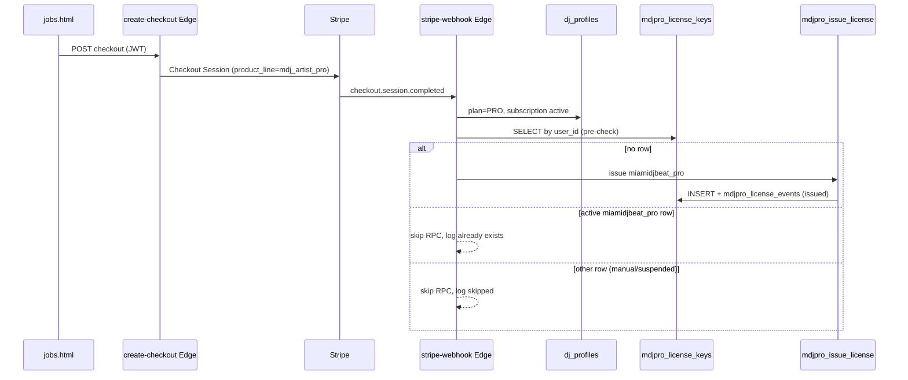

# MDJPRO Licensing Architecture

**Project:** Miami DJ Beat Platform  
**Phase:** Fase 0 (governance) + Fase 1 (Stripe auto-issue)  
**Status:** Local implementation — deploy and prod SQL apply require explicit Captain approval.

---

## 1. Purpose

MDJPRO is the desktop application (macOS). A **license key** (`MDJP-XXXX-XXXX-XXXX-XXXX`) binds a paying user to the app with a **2-seat** device model.

**Commercial rule:** MDJPRO PREMIUM is granted when:

- Miami DJ Beat **Artist PRO** subscription is active (`miamidjbeat_pro`), **or**
- A standalone MDJPRO subscription exists (`mdjpro_standalone` — not implemented yet).

Artist PRO checkout is the first commercial path wired in Fase 1.

---

## 2. Current flow (Fase 1)



**Not in Fase 1:** email delivery, one-time key reveal UI, auto-suspend on cancel.

---

## 2A. SQL activate / heartbeat / revoke

**File:** `supabase/migrations/20260608170000_mdjpro_activate_heartbeat.sql`  
**Status:** Applied in prod (manual SQL). Repo tracks migration for git history.

| RPC | Caller | Purpose |
|-----|--------|---------|
| `mdjpro_activate_device(...)` | service_role | License key hash lookup → lease create/refresh; 7-day `valid_until` |
| `mdjpro_heartbeat(...)` | service_role | Extend lease TTL; gate via `mdjpro_effective_status` |
| `mdjpro_revoke_device(...)` | service_role | Revoke lease; frees seat |

**Events:** `device_activated`, `device_reactivated`, `heartbeat_ok`, `device_revoked`, `activation_rejected`.

**Error codes (JSON `reason`):** `invalid_key`, `invalid_fingerprint`, `rate_limited`, `license_revoked`, `license_suspended`, `license_expired`, `seats_exhausted`, `lease_not_found`, `lease_revoked`, `lease_fingerprint_mismatch`, `lease_expired`, `forbidden`.

**v1 accepted risk:** every successful heartbeat inserts `heartbeat_ok` (no throttle yet).

**Security:** SECURITY DEFINER; REVOKE PUBLIC; GRANT service_role only; license key never stored or returned in plaintext.

---

## 2B. Edge Functions activate / heartbeat (local)

**Files:**

- `supabase/functions/mdj-activate/index.ts` → `rpc('mdjpro_activate_device', …)`
- `supabase/functions/mdj-heartbeat/index.ts` → `rpc('mdjpro_heartbeat', …)`

**Auth:** Mac app calls with **anon key** in `apikey` header; Edge uses `SUPABASE_SERVICE_ROLE_KEY` for RPC. Deploy with **`--no-verify-jwt`** (license key is the credential, not user JWT).

**Env (Edge secrets):** `SUPABASE_URL`, `SUPABASE_SERVICE_ROLE_KEY` (auto-injected on Supabase).

### mdj-activate

`POST` JSON:

```json
{
  "license_key": "MDJP-…",
  "device_fingerprint": "…",
  "hwid_hash": "optional",
  "device_label": "optional",
  "app_version": "2.0.0",
  "os_version": "macOS …"
}
```

Success: **200** + RPC JSON (`ok: true`, `lease_id`, `valid_until`, …).  
Never logs `license_key`.

### mdj-heartbeat

`POST` JSON:

```json
{
  "lease_id": "MDJL-…",
  "device_fingerprint": "…",
  "app_version": "2.0.0",
  "os_version": "macOS …"
}
```

Success: **200** + RPC JSON. Extends 7-day `valid_until`.

### HTTP mapping (RPC `reason` → status)

| Reason | HTTP |
|--------|------|
| `ok: true` | 200 |
| `invalid_key`, `invalid_fingerprint`, invalid body | 400 |
| `forbidden`, license/lease gate failures | 403 |
| `lease_not_found` | 404 |
| `seats_exhausted` | 409 |
| `rate_limited` | 429 |
| RPC/Postgres failure | 500 |

**Safe logs:** `event`, `reason`, `lease_id`, fingerprint **first 8 chars** only.

**Deploy (Captain OK only):**

```bash
supabase functions deploy mdj-activate --no-verify-jwt
supabase functions deploy mdj-heartbeat --no-verify-jwt
```

---

## 3. Database tables

| Table | Role |
|-------|------|
| `mdjpro_license_keys` | One row per user (UNIQUE `user_id`). Stores `key_hash` (never exposed to browser), `key_prefix`, `key_last4`, `plan_source`, `status`, `seats_allowed`, Stripe refs. |
| `mdjpro_device_leases` | Active devices per license (Fase 2+). |
| `mdjpro_license_events` | Audit: `issued`, `reissued`, `auto_issue_skipped`, future `suspended` / `reactivated`. |
| `mdjpro_activation_attempts` | Rate-limit / audit for activate Edge (Fase 2+). |

**RLS:** Authenticated users read licenses only via `mdjpro_license_snapshot()`. Direct SELECT on `mdjpro_license_keys` is **service_role only**.

**Migrations (repo):**

- `supabase/migrations/20260607100000_mdjpro_license_bridge.sql` — schema + RPCs snapshot/effective
- `supabase/migrations/20260608100000_mdjpro_issue_license.sql` — issuance RPC + pepper helpers
- `supabase/migrations/20260608110000_mdjpro_issue_license_hotfix_segment.sql` — segment length type fix

These were applied manually in Supabase prod before Fase 0 git tracking. **Vercel deploy does not apply migrations.**

---

## 4. RPCs

| RPC | Caller | Purpose |
|-----|--------|---------|
| `mdjpro_effective_status(p_uid)` | authenticated, service_role | Computes `effective_premium`, license status, seats. |
| `mdjpro_license_snapshot(p_uid)` | authenticated, service_role | Safe UI payload (masked key, devices). Used by CONFIG → Productos. |
| `mdjpro_issue_license(p_uid, plan_source)` | **service_role only** | Creates or **re-issues** (rotates) license key. Returns `license_key_plaintext` once in JSON — **never log it**. |

### Critical: `mdjpro_issue_license` is NOT idempotent

If a row already exists for `user_id`, the RPC **rotates** `key_hash` and emits `reissued`.  
**Fase 1 webhook must pre-check** and call the RPC only when **no row exists**.

Supported `plan_source` values today: `miamidjbeat_pro`, `manual`.  
`mdjpro_standalone` is rejected by the RPC until a future phase.

---

## 5. Stripe webhook contract (Fase 1)

**File:** `supabase/functions/stripe-webhook/index.ts`  
**Event:** `checkout.session.completed`  
**Branch:** `metadata.product_line === 'mdj_artist_pro'` (default legacy)

**Order of operations:**

1. Update `dj_profiles` → PRO, `subscription_id`, `subscription_status=active`, `next_renewal`.
2. **`mdjproAutoIssueArtistProLicense`** (pre-check + conditional RPC).
3. Existing paths: `payments`, `audit_log`, referrals.

**Pre-check logic:**

| Condition | Action |
|-----------|--------|
| No row in `mdjpro_license_keys` | `rpc('mdjpro_issue_license', { p_uid, p_plan_source: 'miamidjbeat_pro' })` |
| Row exists, `plan_source=miamidjbeat_pro`, `status=active` | Skip RPC; optional backfill `mdb_stripe_subscription_id`; event `auto_issue_skipped` |
| Any other existing row | Skip RPC (protect manual keys); event `auto_issue_skipped` |

**Safe logging only:** `license_id`, `masked_key`, `last4`, `outcome`.  
**Never log:** `license_key_plaintext`.

**Unchanged in Fase 1:** `invoice.paid`, `invoice.payment_failed`, `customer.subscription.deleted`, `customer.subscription.updated`.

---

## 6. Secrets and pepper

| Secret | Where |
|--------|--------|
| `SUPABASE_SERVICE_ROLE_KEY` | Edge Functions (webhook uses for RPC + pre-check) |
| `STRIPE_WEBHOOK_SECRET`, `STRIPE_SECRET_KEY` | stripe-webhook |
| MDJPRO license pepper | Postgres `app.settings.mdjpro_license_pepper` or migration default — **must be rotated before mass sales** |

---

## 7. Legacy parallel model (do not use for new work)

| Legacy | New |
|--------|-----|
| `dj_profiles.hardware_token` | `mdjpro_license_keys` |
| `dj_hardware_bindings` (1 device) | `mdjpro_device_leases` (2 seats) |

Dashboard may still show `hardware_token`; webhook does not populate it.

---

## 8. Risks

| Risk | Mitigation |
|------|------------|
| RPC called with existing row → key rotation | Webhook pre-check (Fase 1) |
| Plaintext in Edge logs | Code review; never log RPC plaintext field |
| User PRO without license row if RPC fails | Monitor `[MDJPRO] issue failed` logs; manual ops until retry tooling |
| Repo/prod drift on migrations | Fase 0: track migrations in git; prod already applied |
| Pepper dev default in DB | Rotate in Supabase before production sales |
| Manual license + Artist PRO purchase | Skip auto-issue; future merge ticket |
| Code deployed ≠ prod until Edge deploy | `supabase functions deploy stripe-webhook` requires Captain OK |

---

## 9. Roadmap (next phases)

| Phase | Scope |
|-------|--------|
| **2A** | SQL RPCs (done) |
| **2B** | Edge `mdj-activate`, `mdj-heartbeat` (local code; deploy pending) |
| **3** | One-time key reveal (account-settings ticket) + optional Resend email |
| **4** | Standalone checkout + `mdjpro_standalone` issuance |
| **5** | Webhook suspend/reactivate on cancel / `past_due` |
| **6** | macOS app integration + E2E QA |

---

## 10. Ops checklist (when authorized)

1. Commit migrations + doc + webhook (separate from frozen MDB identity).
2. Deploy `stripe-webhook` Edge Function only.
3. Stripe test mode: complete Artist PRO checkout → verify row in `mdjpro_license_keys` + event `issued`.
4. Repeat checkout webhook (or replay) → verify `auto_issue_skipped`, no key rotation.
5. Confirm Productos panel shows masked key via `mdjpro_license_snapshot()`.

**Frozen (do not touch in MDJPRO phases unless new ticket):** `mdj_user_ids`, `generate_mdj_user_id()`, `mdj_identity_snapshot()`, account-settings identity blocks.
