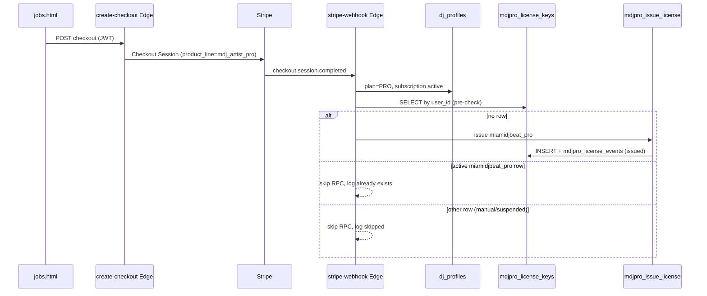
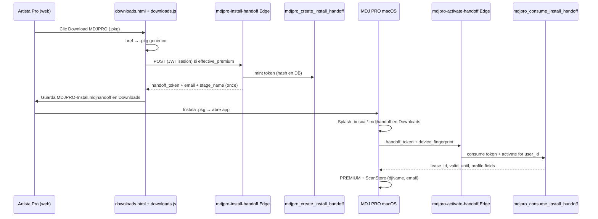

# MDJPRO Licensing Architecture

**Project:** Miami DJ Beat Platform  
**Phase:** Fase 0 (governance) + Fase 1 (Stripe auto-issue) + **CASO-A-001** (install handoff + subscription sync)  
**Status:** Local implementation — deploy and prod SQL apply require explicit Captain approval.

---

## 1. Purpose

MDJPRO is the desktop application (macOS). A **license key** (`MDJP-XXXX-XXXX-XXXX-XXXX`) binds a paying user to the app with a **2-seat** device model.

**Commercial rule:** MDJPRO PREMIUM is granted when:

- Miami DJ Beat **Artist PRO** subscription is active (`miamidjbeat_pro`), **or**
- A standalone MDJPRO subscription exists (`mdjpro_standalone` — not implemented yet).

Artist PRO checkout is the first commercial path wired in Fase 1.

---

## 2. Current flow (Fase 1)



**Not in Fase 1:** email delivery, one-time key reveal UI.

**Implemented in CASO-A-001 (local, deploy pending):** install handoff (Caso A), webhook pause/revoke on non-payment, macOS auto-activate from `.mdjhandoff`.

---

## 2C. Caso A — Pro MDJB descarga → app desbloqueada (CASO-A-001)

**Regla de producto:** 1 cuenta Artist PRO Miami DJ Beat = 1 clave `MDJP-…` en `mdjpro_license_keys`. El instalador `.pkg` es **genérico**; la personalización va en un archivo **`MDJPRO-Install.mdjhandoff`** (15 min TTL, un solo uso).

### Tres caminos comerciales

| Caso | Usuario | Web | Mac al abrir |
|------|---------|-----|--------------|
| **A** | Ya Pro en MDJB | Tools → Descargar (sesión Pro) | PREMIUM, mismo email/nombre, **sin pegar clave** |
| **B** | MDJB no Pro | Stripe upgrade → emisión `MDJP-…` | Tras Pro, igual que A en siguiente descarga |
| **C** | Sin cuenta (frío) | Registro + pago + activación manual | Fase posterior |

### Flujo Caso A



**Seguridad:** la clave completa `MDJP-…` **nunca** va al browser ni al archivo handoff. El servidor activa por `user_id` tras validar el token.

### Archivos (repo)

| Área | Archivo |
|------|---------|
| SQL | `supabase/migrations/20260609100000_mdjpro_install_handoff_and_subscription_sync.sql` |
| Edge mint | `supabase/functions/mdjpro-install-handoff/index.ts` (JWT usuario) |
| Edge consume | `supabase/functions/mdjpro-activate-handoff/index.ts` (`--no-verify-jwt`) |
| Web | `web/js/downloads.js` |
| macOS | `MDJ/AppConfig.swift`, `MDJ/LicenseManager.swift`, `MDJ/WelcomeView.swift` (Desktop copy) |

### RPCs nuevos (CASO-A-001)

| RPC | Caller | Purpose |
|-----|--------|---------|
| `mdjpro_create_install_handoff(p_uid)` | authenticated | Mint token; invalidates prior unconsumed tokens for user |
| `mdjpro_consume_install_handoff(...)` | service_role | Validate token → `mdjpro_activate_device_for_user` |
| `mdjpro_activate_device_for_user(...)` | service_role | Activate lease by `user_id` (no client license key) |
| `mdjpro_apply_subscription_lapse(p_uid, p_mode)` | service_role | `pause` = suspend license row; `revoke` = suspend + revoke all leases |
| `mdjpro_apply_subscription_restored(p_uid)` | service_role | Set license `active` when Artist PRO paid again |

**Tabla:** `mdjpro_install_handoffs` (token_hash, email, stage_name, license_display, expires_at, consumed_at).

### Formato `.mdjhandoff` (JSON)

```json
{
  "version": 1,
  "product": "MDJPRO",
  "handoff_token": "…",
  "email": "dj@example.com",
  "stage_name": "DJ Mago",
  "license_display": "MDJP-****-****-****-ABCD",
  "expires_at": "2026-06-09T…",
  "created_at": "2026-06-09T…"
}
```

Tras consumo exitoso, la app renombra el archivo a `*.used.mdjhandoff`.

### Backup de regresión (Escritorio)

Copia congelada para rollback local:

`~/Desktop/MDJPRO-CASO-A-001-backup-20260609/`

Ver `README-RESTORE.md` en esa carpeta para comandos de restauración y SQL rollback.

---

## 2D. Pausa / revoca automática (deja de pagar)

Cuando el artista **deja de pagar** Artist PRO, MDJPRO desktop debe **pausarse o revocarse** sin intervención manual.

### Capas de enforcement

1. **`mdjpro_effective_status`** — si `dj_profiles.subscription_status` ∉ `{active, trialing}` o plan no PRO → `effective_premium = false`, `license_status = suspended`.
2. **`_mdjpro_effective_license_gate`** — activate/heartbeat devuelven `license_suspended` / `license_revoked`.
3. **Stripe webhook** (`stripe-webhook/index.ts`) — sincroniza fila de licencia y leases:

| Stripe event | `dj_profiles` | RPC MDJPRO | Efecto en Mac |
|--------------|---------------|------------|---------------|
| `invoice.payment_failed` | `past_due` | `mdjpro_apply_subscription_lapse(..., 'pause')` | Licencia suspended; leases activos bloqueados en heartbeat |
| `customer.subscription.deleted` | LITE, cancelled | `mdjpro_apply_subscription_lapse(..., 'revoke')` | Licencia suspended + **leases revoked** |
| `customer.subscription.updated` | status Stripe | pause o restore según status | Alineado con Stripe |
| `invoice.paid` | active + renewal | `mdjpro_apply_subscription_restored` | Licencia `active` de nuevo |

### macOS

`LicenseManager.performHeartbeat()` — si `reason` ∈ `{license_suspended, license_revoked, license_expired, lease_revoked, …}` → `status = CANCELLED`, pierde premium (offline grace no salva si el servidor rechaza).

**Eventos audit:** `subscription_suspended`, `subscription_revoked`, `subscription_reactivated` en `mdjpro_license_events`.

---

## 2A. SQL activate / heartbeat / revoke

**File:** `supabase/migrations/20260608170000_mdjpro_activate_heartbeat.sql`  
**Status:** Applied in prod (manual SQL). Repo tracks migration for git history.

| RPC | Caller | Purpose |
|-----|--------|---------|
| `mdjpro_activate_device(...)` | service_role | License key hash lookup → lease create/refresh; 7-day `valid_until` |
| `mdjpro_heartbeat(...)` | service_role | Extend lease TTL; gate via `mdjpro_effective_status` |
| `mdjpro_revoke_device(...)` | service_role | Revoke lease; frees seat |

**Events:** `device_activated`, `device_reactivated`, `heartbeat_ok`, `device_revoked`, `activation_rejected`.

**Error codes (JSON `reason`):** `invalid_key`, `invalid_fingerprint`, `rate_limited`, `license_revoked`, `license_suspended`, `license_expired`, `seats_exhausted`, `lease_not_found`, `lease_revoked`, `lease_fingerprint_mismatch`, `lease_expired`, `forbidden`.

**v1 accepted risk:** every successful heartbeat inserts `heartbeat_ok` (no throttle yet).

**Security:** SECURITY DEFINER; REVOKE PUBLIC; GRANT service_role only; license key never stored or returned in plaintext.

---

## 2B. Edge Functions activate / heartbeat (local)

**Files:**

- `supabase/functions/mdj-activate/index.ts` → `rpc('mdjpro_activate_device', …)`
- `supabase/functions/mdj-heartbeat/index.ts` → `rpc('mdjpro_heartbeat', …)`

**Auth:** Mac app calls with **anon key** in `apikey` header; Edge uses `SUPABASE_SERVICE_ROLE_KEY` for RPC. Deploy with **`--no-verify-jwt`** (license key is the credential, not user JWT).

**Env (Edge secrets):** `SUPABASE_URL`, `SUPABASE_SERVICE_ROLE_KEY` (auto-injected on Supabase).

### mdj-activate

`POST` JSON:

```json
{
  "license_key": "MDJP-…",
  "device_fingerprint": "…",
  "hwid_hash": "optional",
  "device_label": "optional",
  "app_version": "2.0.0",
  "os_version": "macOS …"
}
```

Success: **200** + RPC JSON (`ok: true`, `lease_id`, `valid_until`, …).  
Never logs `license_key`.

### mdj-heartbeat

`POST` JSON:

```json
{
  "lease_id": "MDJL-…",
  "device_fingerprint": "…",
  "app_version": "2.0.0",
  "os_version": "macOS …"
}
```

Success: **200** + RPC JSON. Extends 7-day `valid_until`.

### HTTP mapping (RPC `reason` → status)

| Reason | HTTP |
|--------|------|
| `ok: true` | 200 |
| `invalid_key`, `invalid_fingerprint`, invalid body | 400 |
| `forbidden`, license/lease gate failures | 403 |
| `lease_not_found` | 404 |
| `seats_exhausted` | 409 |
| `rate_limited` | 429 |
| RPC/Postgres failure | 500 |

**Safe logs:** `event`, `reason`, `lease_id`, fingerprint **first 8 chars** only.

**Deploy (Captain OK only):**

```bash
supabase functions deploy mdj-activate --no-verify-jwt
supabase functions deploy mdj-heartbeat --no-verify-jwt
```

---

## 3. Database tables

| Table | Role |
|-------|------|
| `mdjpro_license_keys` | One row per user (UNIQUE `user_id`). Stores `key_hash` (never exposed to browser), `key_prefix`, `key_last4`, `plan_source`, `status`, `seats_allowed`, Stripe refs. |
| `mdjpro_device_leases` | Active devices per license (Fase 2+). |
| `mdjpro_license_events` | Audit: `issued`, `reissued`, `auto_issue_skipped`, `subscription_suspended`, `subscription_revoked`, `subscription_reactivated`, `device_activated`, … |
| `mdjpro_activation_attempts` | Rate-limit / audit for activate Edge (Fase 2+). |

**RLS:** Authenticated users read licenses only via `mdjpro_license_snapshot()`. Direct SELECT on `mdjpro_license_keys` is **service_role only**.

**Migrations (repo):**

- `supabase/migrations/20260607100000_mdjpro_license_bridge.sql` — schema + RPCs snapshot/effective
- `supabase/migrations/20260608100000_mdjpro_issue_license.sql` — issuance RPC + pepper helpers
- `supabase/migrations/20260608110000_mdjpro_issue_license_hotfix_segment.sql` — segment length type fix
- `supabase/migrations/20260608170000_mdjpro_activate_heartbeat.sql` — activate / heartbeat / revoke
- `supabase/migrations/20260609100000_mdjpro_install_handoff_and_subscription_sync.sql` — Caso A handoff + subscription lapse/restore

These were applied manually in Supabase prod before Fase 0 git tracking. **Vercel deploy does not apply migrations.**

---

## 4. RPCs

| RPC | Caller | Purpose |
|-----|--------|---------|
| `mdjpro_effective_status(p_uid)` | authenticated, service_role | Computes `effective_premium`, license status, seats. |
| `mdjpro_license_snapshot(p_uid)` | authenticated, service_role | Safe UI payload (masked key, devices). Used by CONFIG → Productos. |
| `mdjpro_issue_license(p_uid, plan_source)` | **service_role only** | Creates or **re-issues** (rotates) license key. Returns `license_key_plaintext` once in JSON — **never log it**. |

### Critical: `mdjpro_issue_license` is NOT idempotent

If a row already exists for `user_id`, the RPC **rotates** `key_hash` and emits `reissued`.  
**Fase 1 webhook must pre-check** and call the RPC only when **no row exists**.

Supported `plan_source` values today: `miamidjbeat_pro`, `manual`.  
`mdjpro_standalone` is rejected by the RPC until a future phase.

---

## 5. Stripe webhook contract (Fase 1 + CASO-A-001)

**File:** `supabase/functions/stripe-webhook/index.ts`

### checkout.session.completed (Artist PRO)

**Branch:** `metadata.product_line === 'mdj_artist_pro'` (default legacy)

**Order of operations:**

1. Update `dj_profiles` → PRO, `subscription_id`, `subscription_status=active`, `next_renewal`.
2. **`mdjproAutoIssueArtistProLicense`** (pre-check + conditional RPC).
3. Existing paths: `payments`, `audit_log`, referrals.

**Pre-check logic:**

| Condition | Action |
|-----------|--------|
| No row in `mdjpro_license_keys` | `rpc('mdjpro_issue_license', { p_uid, p_plan_source: 'miamidjbeat_pro' })` |
| Row exists, `plan_source=miamidjbeat_pro`, `status=active` | Skip RPC; optional backfill `mdb_stripe_subscription_id`; event `auto_issue_skipped` |
| Any other existing row | Skip RPC (protect manual keys); event `auto_issue_skipped` |

### Subscription lifecycle (CASO-A-001)

| Event | MDJPRO action |
|-------|---------------|
| `invoice.payment_failed` | `mdjpro_apply_subscription_lapse(uid, 'pause')` |
| `customer.subscription.deleted` | `mdjpro_apply_subscription_lapse(uid, 'revoke')` |
| `customer.subscription.updated` | pause / restore / revoke by Stripe `status` |
| `invoice.paid` | `mdjpro_apply_subscription_restored(uid)` |

See **§2D** for Mac-side behavior.

**Safe logging only:** `license_id`, `masked_key`, `last4`, `outcome`.  
**Never log:** `license_key_plaintext`, `handoff_token`.

---

## 6. Secrets and pepper

| Secret | Where |
|--------|--------|
| `SUPABASE_SERVICE_ROLE_KEY` | Edge Functions (webhook uses for RPC + pre-check) |
| `STRIPE_WEBHOOK_SECRET`, `STRIPE_SECRET_KEY` | stripe-webhook |
| MDJPRO license pepper | Postgres `app.settings.mdjpro_license_pepper` or migration default — **must be rotated before mass sales** |

---

## 7. Legacy parallel model (do not use for new work)

| Legacy | New |
|--------|-----|
| `dj_profiles.hardware_token` | `mdjpro_license_keys` |
| `dj_hardware_bindings` (1 device) | `mdjpro_device_leases` (2 seats) |

Dashboard may still show `hardware_token`; webhook does not populate it.

---

## 8. Risks

| Risk | Mitigation |
|------|------------|
| RPC called with existing row → key rotation | Webhook pre-check (Fase 1) |
| Plaintext in Edge logs | Code review; never log RPC plaintext field |
| User PRO without license row if RPC fails | Monitor `[MDJPRO] issue failed` logs; manual ops until retry tooling |
| Repo/prod drift on migrations | Fase 0: track migrations in git; prod already applied |
| Pepper dev default in DB | Rotate in Supabase before production sales |
| Manual license + Artist PRO purchase | Skip auto-issue; future merge ticket |
| Code deployed ≠ prod until Edge deploy | `supabase functions deploy stripe-webhook` requires Captain OK |

---

## 9. Roadmap (next phases)

| Phase | Scope | Status |
|-------|--------|--------|
| **2A** | SQL RPCs activate/heartbeat | Done (repo + prod manual) |
| **2B** | Edge `mdj-activate`, `mdj-heartbeat` | Local code; deploy pending |
| **CASO-A-001** | Install handoff + macOS auto-activate + subscription sync | **Local done**; deploy pending |
| **3** | One-time key reveal (account-settings) + optional Resend email | Pending |
| **4** | Standalone checkout + `mdjpro_standalone` issuance | Pending |
| **5** | ~~Webhook suspend/reactivate~~ | **Done in CASO-A-001** |
| **6** | macOS E2E QA in prod (handoff + lapse) | Pending Captain QA |

---

## 10. Ops checklist (when authorized)

### Fase 1 (issue on checkout)

1. Commit migrations + doc + webhook (separate from frozen MDB identity).
2. Deploy `stripe-webhook` Edge Function.
3. Stripe test mode: complete Artist PRO checkout → verify row in `mdjpro_license_keys` + event `issued`.
4. Repeat checkout webhook (or replay) → verify `auto_issue_skipped`, no key rotation.
5. Confirm Productos panel shows masked key via `mdjpro_license_snapshot()`.

### CASO-A-001 (handoff + lapse)

1. Apply SQL: `20260609100000_mdjpro_install_handoff_and_subscription_sync.sql` in Supabase.
2. Deploy Edge:
   ```bash
   supabase functions deploy mdjpro-install-handoff
   supabase functions deploy mdjpro-activate-handoff --no-verify-jwt
   supabase functions deploy mdj-activate --no-verify-jwt
   supabase functions deploy mdj-heartbeat --no-verify-jwt
   supabase functions deploy stripe-webhook
   ```
3. Vercel: deploy web (`downloads.js`) when Captain authorizes push.
4. QA Caso A: Pro logged in → Download → `.mdjhandoff` in Downloads → install app → PREMIUM without key entry.
5. QA lapse: Stripe test `invoice.payment_failed` → heartbeat returns `license_suspended` → Mac loses premium.
6. QA cancel: `customer.subscription.deleted` → leases revoked in `mdjpro_device_leases`.

**Rollback local:** `~/Desktop/MDJPRO-CASO-A-001-backup-20260609/README-RESTORE.md`

**Frozen (do not touch in MDJPRO phases unless new ticket):** `mdj_user_ids`, `generate_mdj_user_id()`, `mdj_identity_snapshot()`, account-settings identity blocks.
