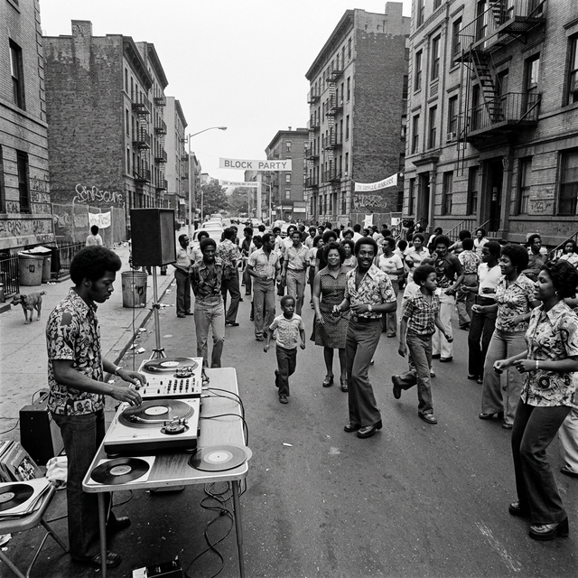

# Bronx 1973: El Nacimiento del Hip Hop y el DJ Moderno

**Introducción**
El 11 de agosto de 1973, en la sala de recreo de un edificio de apartamentos en el 1520 de Sedgwick Avenue en el Bronx, Nueva York, un joven inmigrante jamaicano cambió la historia de la música contemporánea para siempre.

**Cuerpo del Artículo**
Clive Campbell, mejor conocido como DJ Kool Herc, organizó una pequeña fiesta de regreso a clases para su hermana Cindy. Con las influencias del Sound System jamaicano inculcadas en su ADN y un potente equipo de sonido, Kool Herc observó un patrón crítico: el público y los bailarines enloquecían de energía durante los breves "breaks" instrumentales de percusión de los discos de funk y soul (como "Apache" de Incredible Bongo Band).

Herc inventó una técnica revolucionaria llamada "The Merry-Go-Round". Usando dos tocadiscos y dos copias del mismo álbum de vinilo, extendió esos escasos segundos de ritmo funk indefinidamente, saltando la aguja entre un disco y otro para que el "break" percusivo nunca terminara. Al hacerlo, no solo mantuvo la pista de baile en un pico de adrenalina constante, sino que creó el lienzo rítmico infinito sobre el que los "b-boys" (breakdancers) empezaron a realizar acrobacias y los MCs empezaron a improvisar rimas.

Esa noche en el Bronx nació oficialmente la cultura Hip Hop. Tras Herc, leyendas como Grandmaster Flash perfeccionaron mecánicamente esta idea, introduciendo el "slip-cueing" y la mezcla matemática de ritmos (beatmatching), mientras que el joven Grand Wizzard Theodore inventó el "scratching" manual del vinilo. El rol del DJ evolucionó definitivamente. Dejó de ser un mero programador musical para transformarse en un instrumentista en tiempo real que manipulaba giradiscos.

**Conclusión**
El Nueva York de los años 70 nos recuerda que la innovación suprema nace de la lectura milimétrica del público y el atrevimiento a romper las reglas establecidas de los equipos físicos. Ser un DJ profesional de la plataforma MDJPRO implica heredar ese fuego urbano, la creatividad recursiva y la agudeza perceptiva que dio a luz a toda una cultura mundial.
