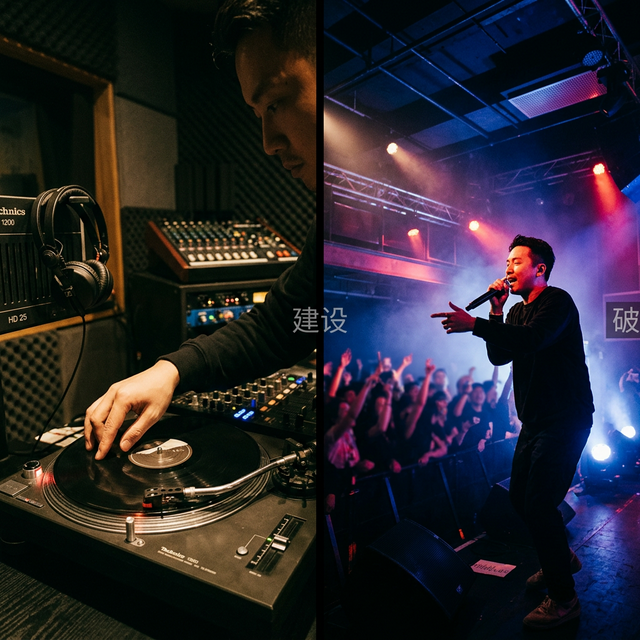

# DJ vs Entertainer: Identidad Profesional

**Introducción**
En la industria actual existe una gran confusión entre ser un DJ (Disc Jockey) purista musical y ser un Entertainer (Animador). Entender la diferencia y decidir dónde te posicionas en este espectro define tu carrera musical.

**Cuerpo del Artículo**
El **DJ Purista** se comunica casi exclusivamente a través de su selección musical y técnica. Rara vez toma el micrófono. Su objetivo es crear un paisaje sonoro inmersivo, un viaje hipnótico donde la estrella principal es la música misma. Es la figura sagrada en los clubes underground y festivales de música electrónica, donde el público va a perderse en el ritmo continuo sin interrupciones.

El **DJ Entertainer** (Animador / Open Format) es una figura híbrida. Domina la técnica de mezcla, pero su herramienta principal es la interacción directa y el carisma. Usa el micrófono para dirigir la energía de la sala, anima a la gente a participar, organiza dinámicas y mezcla géneros dispares ("Open Format") con el único objetivo de maximizar la diversión inmediata. Es el rey indiscutible de eventos corporativos, bodas y clubes comerciales de alta energía.

Ninguno es inferior al otro; son deportes diferentes dentro del mismo ecosistema. Un DJ purista puede aburrir en una fiesta corporativa, y un Entertainer puede arruinar la vibra mística de un club techno a las 4 AM.

**Conclusión**
La Academia DJ te prepara técnicamente para ambas rutas, pero te empuja a encontrar tu propia identidad. El arma más poderosa de un DJ profesional es la autoconsciencia: saber exactamente el tipo de experiencia que ofreces y asegurarte de venderte para el tipo de evento correcto.
