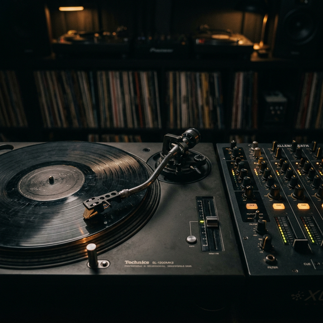

# Manifesto de la Academia DJ

**Introducción**
Nuestra misión es formar verdaderos profesionales del arte del DJ. Ser DJ no es solo dominar una técnica. Es entender la cultura que dio origen a este movimiento, respetar sus raíces y llevar esa energía al público con responsabilidad.

**Cuerpo del Artículo**
El DJ es un arquitecto de emociones. Cada mezcla es una conversación con la pista de baile, cada transición es una historia que conecta generaciones, ciudades y culturas.

En la Academia DJ creemos que el conocimiento debe transmitirse con disciplina, respeto y pasión.

Formamos DJs capaces de:
- Leer la energía de la pista de baile
- Dominar la técnica sin perder el alma musical
- Entender la historia del DJ y su evolución
- Respetar a su público y colegas
- Elevar el estándar de la industria

**Conclusión**
El mundo no necesita un DJ más. **El mundo necesita DJs de verdad.** ¿Estás listo para ser uno de ellos?
