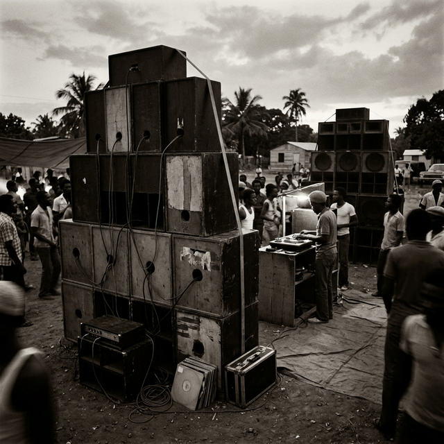

# El Selecta: Cuando Jamaica Inventó el DJ

**Introducción**
Mucho antes de que los DJs llenaran estadios y cobraran cifras astronómicas, la figura del selector de discos nació en las polvorientas calles de Kingston, Jamaica, a finales de los años 50.

**Cuerpo del Artículo**
En la vibrante cultura musical jamaicana, los "Sound Systems" eran discotecas móviles impulsadas por enormes altavoces construidos a mano. El hombre a cargo de la música no era solo un DJ; era el *Selecta*. Su trabajo no consistía en mezclar ritmos perfectamente sincronizados, sino en poseer el conocimiento más profundo de la biblioteca musical y tener acceso a los discos más exclusivos, conocidos como "dubplates".

El Selecta era un curador musical, un líder comunitario y un psicólogo de multitudes. Trabajaba mano a mano con el *Deejay* (que en Jamaica era el MC o vocalista que generaba "hype" e interactuaba con el público, el precursor absoluto del rapero moderno). La competencia entre Sound Systems rivales era feroz, y el éxito del evento dependía enteramente de la munición musical del Selecta. 

Fueron pioneros en conceptos de la cultura de club que hoy damos por sentados: el "rewind" (rebobinar el disco desde el principio si el público enloquecía), el control de la energía de la sala a través de la ecualización, y el concepto de que tener música exclusiva era el arma definitiva de un DJ.

**Conclusión**
La figura histórica del Selecta nos enseña la regla inquebrantable de nuestra profesión: la música siempre es más importante que la técnica. Un profesional moderno debe recordar sus raíces jamaicanas para entender que, más allá de cualquier transición fluida o efecto complejo, seguimos siendo selectores musicales con la misión sagrada de mover el cuerpo y modificar la vibración de nuestra audiencia.
